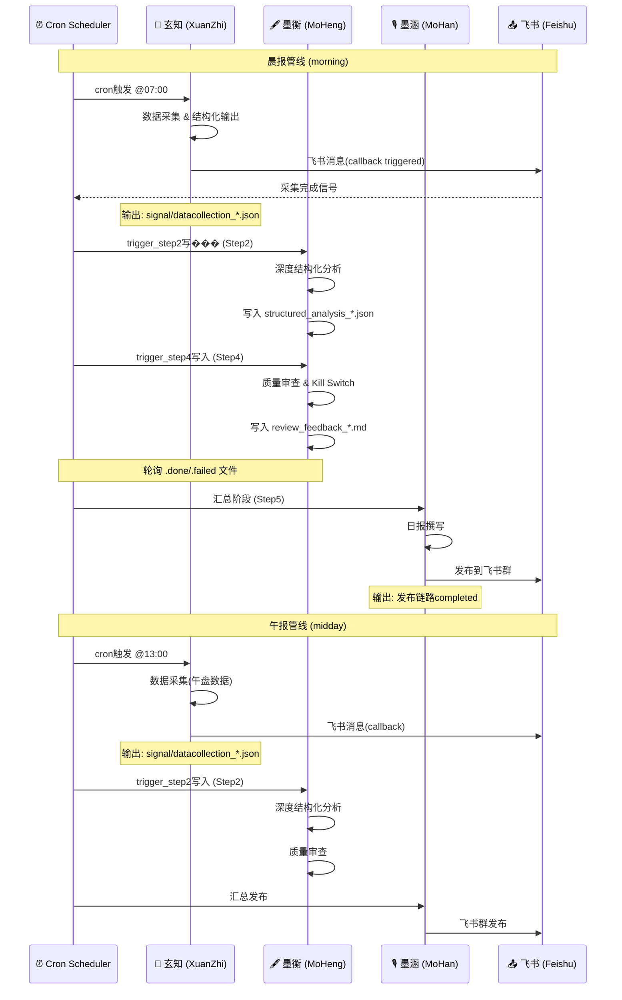

# 管线总览 (Pipeline Overview)

> 墨枢系统多Agent协作管线文档。
> **目标读者**：运维值班人员、新加入墨枢的开发者。
> **一句话定位**：5分钟内定位"晨报崩了查哪个环节"。

---

## 1. 晨报核心管线

以下时序图展示晨报/午报从数据采集到飞书发布的完整调用链：



---

## 2. 管线矩阵

| 管线名称 | 触发时间 | 触发方式 | 依赖管线 | Agent责任人 | 预期产出路径 | 失败影响等级 |
|---------|---------|---------|---------|------------|------------|------------|
| 晨报·玄知采集 | 07:00 CST | cron `cron-mo-xuanzhi-morning` | — | 玄知(XuanZhi) | `signals/datacollection_{task_id}.json` | **P0** — 晨报断供 |
| 晨报·墨衡分析(Step2) | 07:15 CST(约) | trigger_step2 | 玄知采集完成 | 墨衡(Moheng) | `reports/morning/{date}/structured_analysis_{task_id}.json` | **P0** — 无分析稿 |
| 晨报·墨衡审查(Step4) | 07:30 CST(约) | trigger_step4 | 墨衡分析完成 | 墨衡(Moheng) | `reports/morning/{date}/review_feedback_{task_id}.md` | **P0** — 无质检稿 |
| 晨报·墨涵汇总(Step5) | 07:35 CST(约) | reportdraft | 墨衡审查通过 | 墨涵(MoHan) | `最终飞书群发布` | **P0** — 无日报发布 |
| 午报·玄知采集 | 13:00 CST | cron `cron-mo-xuanzhi-midday` | — | 玄知(XuanZhi) | `signals/datacollection_{task_id}.json` | **P1** — 午报断供 |
| 午报·墨衡分析(Step2) | 13:15 CST(约) | trigger_step2 | 午报采集完成 | 墨衡(Moheng) | `reports/midday/{date}/structured_analysis_{task_id}.json` | **P1** — 无午报分析 |
| 午报·墨衡审查(Step4) | 13:30 CST(约) | trigger_step4 | 午报分析完成 | 墨衡(Moheng) | `reports/midday/{date}/review_feedback_{task_id}.md` | **P1** — 无午报质检 |
| 午报·墨涵汇总(Step5) | 13:35 CST(约) | reportdraft | 午报审查通过 | 墨涵(MoHan) | `最终飞书群发布` | **P1** — 无午报发布 |

> **失败影响等级定义**
>
> | 等级 | 含义 | 响应要求 |
> |------|------|---------|
> | **P0** | 系统核心产出中断，需立即响应 | 15分钟内介入 |
> | **P1** | 重要产出中断，可安排修复 | 2小时内介入 |
> | **P2** | 辅助功能受影响 | 24小时内介入 |

---

## 3. 故障排查指南

### 3.1 "晨报没出"

按以下顺序排查：

```
1. 检查 07:00 cron 是否触发
   ├─ `openclaw cron list` → 看 cron-mo-xuanzhi-morning 近状态
2. 检查 signals/triggers/ 下 trigger_step2 文件是否存在
   ├─ 不存在 → 玄知采集失败（检查玄知回调）
3. 检查 reports/morning/{date}/ 下结构化分析产出
   ├─ 不存在 → 墨衡Step2失败（检查墨衡cron日志）
4. 检查 review_feedback 质检产出
   ├─ 不存在或不含 PASS → 墨衡Step4失败 / Kill Switch触发
5. 检查飞书群是否发布
   ├─ 未发布 → 墨涵Step5失败
```

### 3.2 关键信号文件路径

| 检查项 | 文件路径 | 验证状态字段 |
|--------|---------|------------|
| 数据采集完成 | `signals/datacollection_{task_id}.json` | status == "READY" |
| Step2触发 | `signals/triggers/trigger_step2_{task_id}.json` | agent == "moheng" |
| 墨衡分析产出 | `reports/{type}/{date}/structured_analysis_{task_id}.json` | status == "READY" |
| Step4触发 | `signals/triggers/trigger_step4_{task_id}.json` | agent == "moheng" |
| 质检反馈 | `reports/{type}/{date}/review_feedback_{task_id}.md` | [REVIEW_READY] |
| Step5任务完成 | `pipeline/tasks/{task_id}_moheng.done` | 文件存在 |

---

## 4. 文件系统布局总览

```
C:\Users\17699\mo_zhi_sharereports\
├── signals/                      # 信号总线（文件级通信）
│   ├── triggers/                 # Agent触发信号
│   ├── dispatch/                 # 分发信号（会议响应等）
│   ├── consensus/                # 共识层（心跳、�?活检测）
│   │   └── heartbeat/            # Agent心跳（20s超时检测）
│   └── signals/                  # 系统级复合信号
├── reports/                      # 产出报告
│   ├── morning/{date}/           # 晨报产出
│   └── midday/{date}/            # 午报产出
├── pipeline/tasks/               # 任务完成信号（.done / .failed）
├── agents/                       # Agent专属目录
│   └── moheng/meeting_response/  # 墨衡会议响应产出
├── 试验信息库/                    # 飞书数据源镜像
└── code/automation_v2/           # 自动化代码
    └── moheng_heartbeat.py       # 墨衡心跳模块
```
