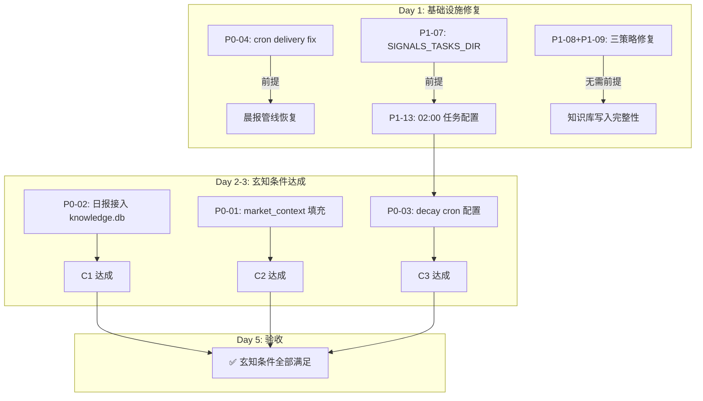

# 墨枢 — 问题清单与下一步计划

**作者:** 墨衡 🖋️  
**创建时间:** 2026-05-16 13:30 +08:00  
**版本:** v1.0  
**数据来源:** 知识库评审会议纪要、玄知战略评审、墨萱代码审查、daily_maintenance 审查、cron 调度清单

---

## 一、问题清单

### P0（阻塞级 — 必须立即解决）

| 编号 | 问题 | 状态 | 影响范围 | 依赖项 | 预估工时 |
|:----|:-----|:----:|:---------|:-------|:-------:|
| **P0-01** | 玄知 C2: market_context 首批数据填充（500/694，剩余 194 条需 akshare 修复） | 🔴 **未完成** | 知识聚合按市场状态分类功能不可用（当前全为 'any'）；玄知 7 天条件 | akshare 数据源可用 | 1.5h |
| **P0-02** | 玄知 C1: 日报接入 knowledge.db 消费 | 🔴 **未完成** | 知识库从"存储"变为"被使用"的关键链路；玄知 7 天条件 | 无 | 2-3h |
| **P0-03** | 玄知 C3: decay 定时任务配置（02:00 cron 中接入） | 🔴 **未完成** | 知识时效性管理自动化；玄知 7 天条件 | daily_maintenance.py P1 修复 | 0.5h |
| **P0-04** | cron delivery target 格式错误导致多 cron 失败 | 🔴 **未完成** | 晨报管线（1 次）、reports归档（9 次）、settle_backup（3 次）全部失败 | 确认正确 chatId | 0.5h |

> **P0-01~P0-03** 截止日期：**2026-05-23**（玄知 7 天条件）

### P1（重要级 — 强烈建议在本迭代完成）

#### 技术遗留（知识库评审）

| 编号 | 问题 | 状态 | 影响范围 | 依赖项 | 预估工时 |
|:----|:-----|:----:|:---------|:-------|:-------:|
| **P1-01** | `_find_project_root()` 环境变量检查外的备份方案 | ⚠️ **已修复（方案）待确认实施** | 非标准安装路径下的项目根探测健壮性 | 无 | 0.3h |
| **P1-02** | 知识库信度衰减配置参数（decay_check 的 max_age_days 参数化） | ⚠️ **已实现但未外部化配置** | 衰减规则不可配置 | 无 | 0.3h |
| **P1-03** | `make_run_id()` 追加微秒/UUID 消除秒级碰撞 | 🔴 **未修复** | 高频回测场景 run_id 冲突（当前回测频率低、风险低但随频率上升） | 无 | 0.3h |
| **P1-04** | 知识库 `close()` 方法加显式关闭逻辑 | ✅ **已实现**（`__exit__` 自动调用） | 无 | 无 | — |
| **P1-05** | `scripts/backfill_knowledge_db.py` 双路径验证（旧路径+新平台 backup 验证） | ⚠️ **部分实现** | 数据回填完整性验证 | 无 | 0.5h |
| **P1-06** | backtest_results 文件数量统计和容量监控 | 🔴 **未实现** | 长期监控回测产出文件增长 | 无 | 0.5h |

#### 代码审查新增问题

| 编号 | 问题 | 状态 | 影响范围 | 依赖项 | 预估工时 |
|:----|:-----|:----:|:---------|:-------|:-------:|
| **P1-07** | `daily_maintenance.py` SIGNALS_TASKS_DIR 路径指向不存在目录 | 🔴 **未修复** | cleanup 功能永久失效 | 确认正确路径 | 0.2h |
| **P1-08** | 三策略 profit_factor 字段映射缺少双键容错 | 🔴 **未修复** | 若 metrics 中字段名为 profit_factor 而非 profit_loss_ratio 则数据丢失 | 无 | 0.3h |
| **P1-09** | `run_reversal.py` config_key 与其他策略不一致（使用 config.signal_type 而非完整 f-string） | 🔴 **未修复** | 回填后查询无法统一按 config_key 过滤 | 无 | 0.2h |
| **P1-10** | `backfill_run()` / `update_performance()` 静默吞异常（缺少 logging） | ⚠️ **设计稿待追加** | 回填/补录失败时无错误日志，排查困难 | 无 | 0.3h |
| **P1-11** | DDL 缺少组合索引 `(strategy, symbol, created_at DESC)` | ⚠️ **已建单索引但无组合索引** | 联合查询场景可能全表扫描（当前 694 条性能可接受） | 无 | 0.2h |

#### pipeline 与系统集成

| 编号 | 问题 | 状态 | 影响范围 | 依赖项 | 预估工时 |
|:----|:-----|:----:|:---------|:-------|:-------:|
| **P1-12** | pipeline 集成缺口（knowledge_db 仅 Step3/5 覆盖） | 🔴 **未实现** | 知识库在管线中的角色受限 | 无 | 1-2h |
| **P1-13** | daily_maintenance 未配置 Windows 任务计划程序 02:00 | 🔴 **未配置** | 日志归档、知识维护未自动化 | P1-07 修复 | 0.3h |
| **P1-14** | 晨报管线 cron 失败（delivery target 格式错误） | 🔴 **P0-04 的子问题** | 晨报断供风险（已有 1 次失败记录） | P0-04 | — |

#### 知识库战略盲点

| 编号 | 问题 | 状态 | 影响范围 | 依赖项 | 预估工时 |
|:----|:-----|:----:|:---------|:-------|:-------:|
| **P1-15** | 知识反馈循环未闭环（报告结论未回写 knowledge_entries） | 🔴 **未设计** | 知识库"只存不用"，价值无法验证 | P0-02 先行 | 设计阶段 |
| **P1-16** | 无 metadata 全局视图（所有回测 JSON 的元数据概览） | 🔴 **未实现** | 无法快速了解知识库全貌 | 无 | 1h |

### P2（优化级 — 可延至下轮迭代）

| 编号 | 问题 | 状态 | 影响范围 | 依赖项 | 预估工时 |
|:----|:-----|:----:|:---------|:-------|:-------:|
| **P2-01** | `init_knowledge_db.py --force` 未增加 `makedirs` 确保目录存在 | 🔴 **未修复** | 边缘场景建表失败（父目录缺失） | 无 | 0.1h |
| **P2-02** | `daily_maintenance --dry-run` 下仍写日报文件 | 🔴 **未修复** | dry-run 语义不纯 | 无 | 0.2h |
| **P2-03** | 日报回测汇总表无 LIMIT（689 行写入报告） | 🔴 **未修复** | 报告过长，可读性差 | 无 | 0.2h |
| **P2-04** | `_query_knowledge_status()` 异常处理使用 `pass` | 🔴 **未修复** | 异常静默吞，用户无法感知 | 无 | 0.1h |
| **P2-05** | `scripts/` 中 notify_*.json 文件堆积 | 🔴 **未清理** | 文件管理杂乱 | 无 | 0.2h |
| **P2-06** | market_context 降级填充方案（均线+ATR 粗分类替代 akshare） | 🔴 **未实现** | T6 未到位时的备选方案 | 无 | 1h |

### 跟踪项（非技术问题，需持续关注）

| 编号 | 问题 | 状态 | 复查日期 | 备注 |
|:----|:-----|:----:|:---------|:-----|
| **T-01** | pipeline.db 建设挂账 | 📅 **2026-06-01 复查** | 2026-06-01 | 条件：管线稳定度 + knowledge_db 产出 + 文档统一情况 |
| **T-02** | 知识库"重存轻用"长期风险 | 📅 **持续** | — | 玄知战略评审指出：90% 价值在消费端 |
| **T-03** | SQLite 长期扩展性（2000-5000 条后的性能） | 📅 **季度回顾** | — | 建议每月 VACUUM + wal_checkpoint |
| **T-04** | 知识质量的后续验证（validity 自我修正） | 📅 **后续版本** | — | knowledge_entries 增加 validity_tracking 字段 |

---

## 二、下一步计划

### 2.1 短期（3-7 天：2026-05-16 ~ 2026-05-23）

**核心目标：满足玄知 7 天条件 + 恢复 cron 稳定性**

| 日次 | 任务 | 执行人 | 预估工时 | 依赖 | 产出 |
|:---:|:-----|:------:|:--------:|:-----|:-----|
| Day 1 | **P0-04**: 修复 cron delivery target 格式 | 墨衡 | 0.5h | — | 晨报管线恢复<br/>reports归档恢复 |
| Day 1 | **P1-07**: 修复 daily_maintenance SIGNALS_TASKS_DIR 路径 | 墨衡 | 0.2h | 确认正确路径 | cleanup 功能可用 |
| Day 1 | **P1-08**: 修复三策略 profit_factor 双键容错 | 墨衡 | 0.3h | — | 数据完整性保障 |
| Day 1 | **P1-09**: 修复 run_reversal.py config_key 一致性 | 墨衡 | 0.2h | — | 查询兼容性 |
| Day 1 | **P2-01~P2-04**: 批量修复 daily_maintenance 和 init_knowledge_db 小问题 | 墨衡 | 0.6h | — | 代码质量提升 |
| Day 1 | ^^^^^^^^^ 集合工时 ^^^^^^^^ | 墨衡 | **1.0h** | | |
| Day 2 | **P0-02**: 日报接入 knowledge.db 消费（最小可用版本） | 墨衡 + 墨涵 | 2.5h | 无 | 日报出现"历史对照"区块引用 knowledge_entries |
| Day 3 | **P0-01**: market_context 194 条数据填充（akshare 修复） | 墨衡 | 1.5h | akshare 可用 | market_context 表 694/694 全量覆盖 |
| Day 3 | **P0-03**: decay 定时任务配置 + 测试 | 墨衡 | 0.5h | P1-07 修复 | 每日 02:00 衰减自动化 |
| Day 3 | **P2-05**: clean-p notify_*.json 堆积文件 | 墨涵 | 0.2h | — | 文件整洁 |
| Day 3 | ^^^^^^^^^ 集合工时 ^^^^^^^^ | 墨衡 | **2.0h** | | |
| Day 4 | **P1-10**: backfill_run logging.exception 追加 | 墨衡 | 0.3h | — | 异常可排查 |
| Day 4 | **P1-11**: DDL 组合索引追加 | 墨衡 | 0.2h | — | 查询性能 |
| Day 4 | **P1-13**: Windows 任务计划程序配置 02:00 daily_maintenance | 墨衡 | 0.3h | P1-07 已修复 | 自动运维 |
| Day 4 | ^^^^^^^^^ 集合工时 ^^^^^^^^ | 墨衡 | **0.8h** | | |
| Day 5 | **验收**: 验证玄知 3 条件全部满足 | 墨涵 | 0.3h | Day 1~4 全部完成 | 5/5 检查清单 |
| Day 5 | **文件注册**: 注册新/变更文件到 file_registry.db | 墨涵 | 0.3h | — | 完整文件追踪 |
| Day 5~6 | **P1-03**: make_run_id 微秒追加 | 墨衡 | 0.3h | — | 消除秒级碰撞 |
| Day 5~6 | **P1-06**: backtest_results 监控脚本 | 墨衡 | 0.5h | — | 文件增长监控 |
| Day 5~6 | **P1-16**: metadata 全局视图 | 墨衡 | 1h | — | 知识库全景概览 |
| Day 5~6 | ^^^^^^^^^ 集合工时 ^^^^^^^^ | 墨衡 | **1.8h** | | |
| Day 7 | **缓冲日**：处理 unforeseen 问题 + Code Review | 墨萱 | 1h | — | 代码审查闭环 |

**短期总计工时：** 墨衡 ~5.6h / 墨萱 ~1h / 墨涵 ~0.8h = **~7.4h**

**验证标准（5/5）：**
- [ ] 晨报管线 cron ✅（连续 3 天无失败）
- [ ] 日报出现 knowledge.db 引用 ✅
- [ ] market_context 全量 694/694 ✅
- [ ] decay 定时任务运行成功 ✅
- [ ] daily_maintenance --report 正常运行 ✅

### 2.2 中期（2 周：2026-05-23 ~ 2026-06-06，含 pipeline.db 复查）

| 周次 | 任务 | 执行人 | 预估工时 | 依赖 |
|:---:|:-----|:------:|:--------:|:-----|
| W1 | **市场状态降级填充**（P2-06）：均线+ATR 粗分类填充所有回测标的 | 墨衡 | 1h | — |
| W1 | **market_context 增量回填脚本**：将 market_scan 输出实时写入 knowledge.db | 墨衡 | 1h | P0-01 |
| W1 | **pipeline 集成**（P1-12）：knowledge_db 覆盖 Step2/Step5 的调用点 | 墨衡 | 1-2h | P0-02 |
| W1 | **知识反馈循环设计**（P1-15）：方案评审 | 墨衡 + 墨涵 | 1h | P0-02 |
| W1 | ^^^^^^^^^ 集合工时 ^^^^^^^^ | 墨衡 | **3-5h** | |
| W2 | **pipeline.db 复查**（T-01）：管线稳定度 + knowledge_db 产出 + 文档统一情况 | 墨衡 | 1h | 前期任务完成 |
| W2 | **策略参数有效性分析**：利用 knowledge_entries 数据做策略回顾 | 墨衡 | 2h | 知识库已消费 |
| W2 | **回填脚本双路径验证**（P1-05） | 墨衡 | 0.5h | — |
| W2 | **整体代码 Code Review + 清理** | 墨萱 | 1.5h | 所有修复完成 |
| W2 | ^^^^^^^^^ 集合工时 ^^^^^^^^ | 墨衡 | **3.5h** | |

**中期总计工时：** 墨衡 ~6.5-8.5h / 墨萱 ~1.5h / 墨涵 ~1h = **~9-11h**

---

## 三、依赖关系图

### 3.1 玄知条件 7 天路径（核心路径）



### 3.2 并行/串行映射

| 并行组 | 可并行任务 | 说明 |
|:------:|:----------|:-----|
| **组 A** | P0-04, P1-07, P1-08, P1-09, P2-01~P2-04 | 独立任务，无交叉依赖 |
| **组 B** | P0-02, P0-01, P0-03 | 可部分并行（编码层面互相独立），但若同一人执行建议串行，Day2+P0-02, Day3+P0-01+P0-03 |
| **组 C** | P1-10, P1-11, P1-13, P1-06, P1-16 | 全独立，可任意顺序 |
| **组 D** | T-01 pipeline.db 复查, P1-12 pipeline 集成, P1-15 反馈设计 | pipeline.db 复查需管线稳定，依赖组 B 完成 |

### 3.3 完整依赖关系

```
Cron delivery fix (P0-04)
├── 晨报管线恢复
├── reports归档恢复
└── settle_backup恢复

SIGNALS_TASKS_DIR (P1-07)
└── daily_maintenance cleanup 功能 → 02:00 cron配置 (P1-13) → decay定时任务 (P0-03)
                        └── 日报消费 (P0-02) 独立，仅需 daily_maintenance 基本可用

三策略修复 (P1-08, P1-09) ── 独立 ──→ 知识库写入完整性

市场状态填充 (P0-01) ── 独立 ──→ 按市场分类的知识聚合有效
                                     ↓
日报知识库接入 (P0-02) ── 独立 ──→ 知识可见价值
                                     ↓
                              pipeline集成 (P1-12)
                                     ↓
                              知识反馈环设计 (P1-15)
```

---

## 四、工时汇总

### 按优先级

| 优先级 | 任务数 | 预估总工时 |
|:------:|:------:|:----------:|
| **P0** | 4 | 5-6.5h |
| **P1** | 16 | 4-5.5h |
| **P2** | 6 | 1.8h |
| **跟踪项** | 4 | 持续关注 |

### 按执行人

| 执行人 | 短期（3-7天） | 中期（2周） | 合计 |
|:------:|:-------------:|:-----------:|:----:|
| 墨衡 🖋️ | ~5.6h | ~6.5-8.5h | ~12-14h |
| 墨萱 🔍 | ~1h | ~1.5h | ~2.5h |
| 墨涵 📋 | ~0.8h | ~1h | ~1.8h |
| **合计** | **~7.4h** | **~9-11h** | **~16-18h** |

---

## 五、风险管理

| 风险 | 概率 | 影响 | 缓解措施 |
|:----|:----:|:----:|:---------|
| akshare 数据源不可用于 market_context 填充 | 中 | 高（条件 C2 无法按时达成） | **备选**：P2-06 降级方案（均线+ATR 粗分类），投入 1h 即可 |
| 日报消费 knowledge.db 改动量大 | 低 | 高（条件 C1 延迟） | **范围控制**：最小可用版本（日报中加一行"历史对照"），不超过 2.5h |
| 晨报管线连续失败累积（已 1 次） | 中 | 高（P0 晨报断供） | **Day1 优先修复** P0-04，不做任何依赖 |
| pipeline.db 复查时管线仍不稳定 | 低 | 中（T-01 延期） | **自然延期**：复查时间点为 2 周后，足够稳定 |
| config_key 修复影响已有回填数据 | 低 | 低（仅影响新写入） | **兼容设计**：只改新写入逻辑，不重构已有数据 |
