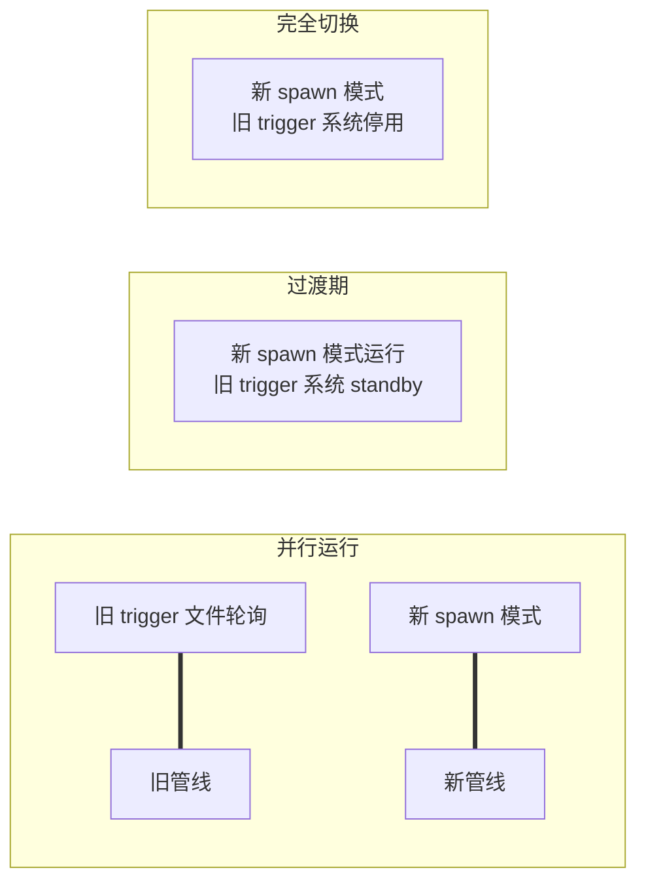

# 早报管线 cron+spawn 改造方案 — 评估报告

<!-- author: 墨衡 (moheng) | created_time: 2026-05-16T14:55+08:00 -->

---

## 1. 现状分析摘要

### 1.1 现行管线架构

```
08:00 cron (openclaw, agent=mochen, isolated session)
  │
  ├─ daily_morning_run.py        ← 交易日检查、心跳写入、pytest自检、漂移检测
  │
  └─ 主 session 内通过 trigger 文件驱动子 agent
       ├── signals/triggers/trigger_step0_{task_id}.json  →  玄知cron轮询
       ├── signals/triggers/trigger_step1_{task_id}.json  →  墨衡cron轮询
       ├── signals/triggers/trigger_step2_{task_id}.json  →  墨萱cron轮询
       ├── signals/triggers/trigger_step3_{task_id}.json  →  墨衡cron轮询
       ├── signals/triggers/trigger_step3.5_{task_id}.json → 玄知cron轮询
       ├── signals/triggers/trigger_step4_{task_id}.json  →  墨萱cron轮询
       └── signals/triggers/trigger_step5 (mochen自执行)  →  飞书推送
```

### 1.2 关键发现

| 发现 | 说明 |
|:----|:------|
| **`src/dispatcher/` 不存在** | 原 dispatcher 在 `src/trading/signals/dispatcher.py`，仅做模块 re-export（指向 `scheduler.dispatcher`），该模块实质为空（`__init__.py` + `__pycache__`） |
| **实际驱动者是各 agent 的 cron 轮询** | 子 agent（玄知/墨衡/墨萱）各自有 cron 任务，每 30s/60s 轮询 `signals/triggers/` 目录发现 trigger 文件后执行对应步骤 |
| **`morning_pipeline_scheduler.md` 已有完整 spawn 设计** | 墨衡在 2026-05-15 已撰写了完整的串行 spawn 调度文档，包含每步的 trigger 模板、等待逻辑、超时仲裁、熔断规则 |
| **2026-05-15 实际跑通全流程** | 验证文件: `morning_report_20260515_step0~5_*.done` 全部存在，08:00→08:33 完成（33分钟） |
| **现有 trigger 文件格式与文档完全吻合** | `trigger_step1_morning_report_20260515.json` 等文件字段与 scheduler.md 模板一致 |
| **.done 文件混用两种格式** | 玄知/墨衡用 `[DONE]` 标记文本格式，墨涵用 JSON 格式——需统一 |

### 1.3 现有 cron 配置

| 项目 | 值 |
|:----|:---|
| cron ID | `ce760f90` |
| 名称 | `早报管线-main` |
| 调度 | `0 8 * * 1-5` (周一至周五 08:00 CST) |
| 责任人 | `mochen` |
| session 模式 | `isolated` |
| wake 模式 | `now` (立即执行) |
| delivery | `announce` (回告, 但有 feishu chat 前缀格式问题) |
| 最近状态 | ⚠️ error (1次, feishu delivery 前缀) |

---

## 2. 新方案可行性评估

### 2.1 启动方式

**问题**: cron 如何触发墨涵？墨涵是否能在 cron 上下文中执行 spawn？

**评估**: ✅ **可行**

- cron 的 `payload.kind=agentTurn` 已配置为 `isolated` session，墨涵作为 main agent 接收启动消息
- 墨涵（agentId=mochen）在 OpenClaw 架构中**完全支持** `sessions_spawn` —— 这是 OpenClaw 的核心能力
- cron 消息体中已设置执行早报管线的提示词，墨涵收到后直接 spawn 各子 agent 即可
- **无需外部脚本启动**，所有逻辑由墨涵在 cron session 中自行编排

**风险**: 低。cron session 是 `isolated`（独立），不会冲突出 main session。

### 2.2 串行控制

**问题**: 墨涵主 spawn session 怎么等子 agent 完成再 spawn 下一个？

**当前机制** (trigger 文件 + cron 轮询): 各子 agent 的 cron 轮询 trigger 目录，发现后执行 → 写 `.done` → 墨涵另一端 cron 轮询 `.done` 文件，推进到下一步。

**新方案** (直接 spawn): `sessions_spawn` 天然支持串行控制——`sessions_spawn` 返回结果后（子 agent 的 Announce），墨涵再启动下一个 spawn。

**评估**: ✅ **可行，但需注意以下架构差异**

| 维度 | 现行 (文件轮询) | 新方案 (spawn 等待) |
|:----|:---------------|:-------------------|
| 等待机制 | cron 轮询 `.done` 文件 | 等待 `Announce` 回调（异步事件驱动） |
| 并发模型 | 各 agent cron 独立并行并轮询 | 墨涵串行 spawn，子 agent 单步执行 |
| 轮询延迟 | 每 30s-60s 轮询一次，有延迟 | 无轮询延迟，子 agent 完成即通知 |
| 复杂度 | 低（文件系统驱动，可靠） | 中（依赖 OpenClaw spawn/Announce 协议） |

**关键限制**: 子 agent 的 spawn 完成后，墨涵收到的是 **子 agent 的最终回复**（即 Announce）。墨涵需要解析 Announce 中的 `[DONE]:{task_id}` 标记，判断执行状态。

**建议**: `.done` 文件作为**故障备份通道**保留。墨涵收到 Announce 后**额外读 .done 文件验证**（双确认），防止 Announce 丢失导致状态不一致。

### 2.3 超时机制

**问题**: 每步超时怎么办？现行 dispatcher 有超时逻辑。

**现状**: `morning_pipeline_scheduler.md` 中定义了四级超时仲裁：
1. 检查 `.done` 文件 → 存在则跳过 2-4
2. 检查 `.failed` 文件 → 标记失败
3. 检查 `.progress` 文件（进度文件）
4. 调子 agent session 看日志

**新方案**: 墨涵在 spawn 后启动一个本地 timer（`yieldMs` 或 Promise.race 模式），到期检查：
- 若收到 Announce → 检查 verdict → 推进下一步
- 若超时未收到 Announce → 检查 `.done`/`.failed`/`.progress` 文件
- 若仍无结果 → 重试或熔断

**评估**: ✅ **可行，但需注意**

| 步 | agent | 预估耗时 | 建议超时 | 重试 | 可否跳过 |
|:--:|:-----:|:--------:|:--------:|:----:|:-------:|
| Step0 | 玄知 | 5min | 480s (8min) | 1次 | ❌ 不可跳过 |
| Step1 | 墨衡 | 10min | 780s (13min) | 1次 | ❌ 不可跳过 |
| Step2 | 墨萱 | 5min | 480s (8min) | 1次 | ⚠️ 可选跳过 |
| Step3 | 墨衡 | 5min | 480s (8min) | 1次 | ❌ 不可跳过 |
| Step3.5 | 玄知 | 5min | 480s (8min) | 1次 | ⚠️ 可选跳过 |
| Step4 | 墨萱 | 5min | 480s (8min) | 1次 | ❌ 不可跳过 |
| Step5 | 墨涵(自) | 2min | 180s (3min) | 3次(内) | ❌ 不可跳过 |

**风险**: 中。OpenClaw 的 `sessions_spawn` 目前主要通过 `yieldMs` 实现等待超时，没有内置的 deadline/timer API。墨涵需要**在 spawn 返回后自行计时**，通过 schedule/process 工具管理超时。

**推荐实现方案**:
1. spawn 子 agent（设置 `yieldMs = 30s` 快速轮询）
2. 收到子 agent 的首次响应后（通常是任务已接收确认），立即启动后台计时器（`process` 工具，yield 一定秒数后检查）
3. 循环轮询，每次检查 `.done`/`.failed` 文件和子 agent session 状态
4. 超时后执行重试或熔断决策

### 2.4 熔断

**问题**: 某步 FAIL 后整条管线如何终止？

**评估**: ✅ **可行，需明确定义传播规则**

```
Step FAIL ──→ 终止管线（严格传播，不可跳过）
  └─ 墨涵向飞书群发送终止通知

Step WARN ──→ 继续管线（修改指令附加到下一步）
  └─ 墨涵记录 WARN 意见

Step 超时 ──→ 重试1次 → 仍超时 → 视为 FAIL

熔断阈值：单步骤最多执行 2 次（含重试）
        整管线累计 3 次 FAIL → 终止并通知主人

熔断后动作：
  1. 写 morning_abort_{task_id}.done（含失败步骤 + 原因）
  2. 墨涵发消息到飞书群 @主人
  3. 管线终止，不再推进后续步骤
```

### 2.5 状态恢复

**问题**: 若墨涵主 session 中途重启，已完成的 step 如何处理？

**评估**: ⚠️ **高风险 — 这是改造的核心挑战**

**现状**: trigger 文件 + `.done` 文件的文件系统驱动模式天然支持状态恢复——agent 重启后读目录即可知道哪些 step 已完成、哪些 pending。

**新方案**: spawn 模式下，状态存在墨涵的 session 内存中。若墨涵 session 重启：
- `.done` 文件仍在（文件系统持久化）
- 但墨涵的 spawn 状态机丢失，不知道当前执行到了哪一步
- 重新 spawn 已完成的 step 会**重复执行**（非幂等）

**可能的恢复方案**:

| 方案 | 复杂度 | 可靠性 | 说明 |
|:----|:------:|:------:|:-----|
| **定期写 checkpoint 文件** | 低 | 高 | 每完成一步，墨涵写 `checkpoint_{task_id}.json`，记录当前进度 |
| **开机扫描 .done 文件** | 低 | 高 | 墨涵 session 恢复后扫描 `.done` 文件，跳步恢复 |
| **完整状态恢复文件** | 中 | 高 | 写完整的状态文件（各 step 状态、完成时间、输出路径） |

**推荐方案**: 结合 1+2。每步完成后写 checkpoint，session 恢复后读 checkpoint + .done 文件跳步，同时记录 `done_timestamp` 确保顺序锚点。

### 2.6 与现有触发器兼容

**问题**: 是否需要保留双向兼容？还是一次性切换？

**评估**: **建议分阶段切换，保留双向兼容**



| 阶段 | 动作 | 时长 | 风险 |
|:----|:-----|:----|:----|
| **Phase1 (并行测试)** | 新 spawn 模式在非交易时段跑 Mock 测试，旧管线照常 | 3-5天 | 低 |
| **Phase2 (灰度)** | 新 spawn 模式跑实际早报，保留旧 trigger 系统作为 fallback | 3-5天 | 中（双写 .done 可能冲突） |
| **Phase3 (完全切换)** | 停止旧 trigger 轮询 cron，完全使用 spawn 模式 | 永久 | 低（如出问题可回退） |

**兼容策略**: 新 spawn 模式仍然**写入 `.done` 文件**（因为其他 agent 可能依赖 `.done` 文件做状态判断），但不依赖 trigger 文件（旧系统的触发入口不再写入）。

### 2.7 task_id 生成

**问题**: 现行 trigger 文件用 task_id 关联整条管线，spawn 模式下如何传递？

**评估**: ✅ **简单**

现行格式: `morning_report_{YYYYMMDD}_step{X}`
- 由墨涵在 spawn 前动态生成（使用当天日期）
- 通过 spawn TASK 消息体中的 `{YYYYMMDD}` 模板替换
- 子 agent 以 task_id 为基础命名输出文件和 .done 文件

spawn 模式下完全可复用同一套 task_id 生成逻辑：
- 墨涵维护一个 session 级变量 `task_id_date = datetime.now().strftime('%Y%m%d')`
- spawn 消息体中通过模板字符串 `{YYYYMMDD}_{stepX}` 传递给子 agent
- 子 agent 按约定产出文件

**不变的部分**: `task_id` 仍是整条管线的关联键，仅传递方式从 trigger 文件变为 spawn 消息体。

### 2.8 飞书推送

**问题**: Step5 墨涵推送是否仍用现有的 webhook/飞书接口？

**评估**: ✅ **无需改动**

墨涵（mochen）已配置飞书机器人，通过 `message` 工具发送到飞书群：
- 目标群 ID: `oc_72bacde2a63f824bd011718fbe58f48a`
- delivery mode: `announce`（但也存在格式问题）
- 墨涵在 Step5 中自行执行推送，不需要 spawn 其他 agent

**需修复的问题**: 现有 cron 配置中 `delivery.to` 使用了 `feishu:chat:` 前缀而非 `chat:`，导致 delivery 失败。修复配置即可。

---

## 3. 每步的 spawn 配置表

### 3.1 整体配置

| 步骤 | 子任务名 | 子Agent | 预估耗时 | 超时阈值 | 重试 | 可跳过 | 输入文件 | 输出文件 |
|:----:|:--------:|:-------:|:--------:|:--------:|:----:|:------:|:---------|:---------|
| **预检** | is_trading_day | 墨涵(自) | 即时 | — | — | — | — | — |
| **Step0** | morning_scan | 玄知 | 5min | 480s(8min) | 1次 | ❌ | —(联网采集) | `reports/morning/{date}/macro_analysis_*.json` |
| **Step1** | morning_analysis | 墨衡 | 10min | 780s(13min) | 1次 | ❌ | Step0 output | `reports/morning/{date}/structured_analysis_{task_id}.json` |
| **Step2** | morning_draft | 墨萱 | 5min | 480s(8min) | 1次 | ⚠️ | Step1 output | `reports/morning/{date}/morning_draft_{task_id}.md` |
| **Step3** | morning_review | 墨衡 | 5min | 480s(8min) | 1次 | ❌ | Step2 output + Step1 | `reports/morning/{date}/review_feedback_{task_id}.md` |
| **Step3.5** | morning_strategic_review | 玄知 | 5min | 480s(8min) | 1次 | ⚠️ | Step1 output | `signals/strategic_review_{task_id}.json` |
| **Step4** | morning_finalize | 墨萱 | 5min | 480s(8min) | 1次 | ❌ | Step2+3+3.5 outputs | `reports/morning/{date}/final_report_{task_id}.md` |
| **Step5** | morning_push | 墨涵(自) | 2min | 180s(3min) | 3次(内) | ❌ | Step4 output | 飞书群消息 + `.done` |

### 3.2 各 step 详细 spawn 参数

#### 预检 (is_trading_day)

| 字段 | 值 |
|:----|:---|
| **执行者** | 墨涵自身 |
| **输入** | 交易日历（`trade_calendar.py` 或 datetime.weekday()） |
| **输出** | 非交易日 → 写 `morning_skip.done` → 终止 |
| **逻辑** | 周一~周五视为交易日 |

#### Step0: 玄知市场扫描

| 字段 | 值 |
|:----|:---|
| **agentId** | `xuanzhi` |
| **dependency** | None |
| **spawn 消息体** | `# 你：玄知\n# 任务：晨间市场扫描(Step0)...` (含具体采集项) |
| **输出文件** | `reports/morning/{date}/macro_analysis_{task_id}.json` |
| **等待条件** | Announce([DONE]:{task_id}) + `.done` 文件验证 |
| **超时行为** | 重试1次(写新trigger)，仍超时 → FAIL → 终止管线 |

#### Step1: 墨衡结构化分析

| 字段 | 值 |
|:----|:---|
| **agentId** | `moheng` |
| **dependency** | Step0 .done |
| **输入文件** | `reports/morning/{date}/macro_analysis_*.json` |
| **spawn 消息体** | 含 Step0 产出路径 + SOUL.md Step2 分析要求 |
| **输出文件** | `reports/morning/{date}/structured_analysis_{task_id}.json` |
| **等待条件** | Announce([DONE]:{task_id}) + `.done` 验证 |
| **超时行为** | 重试1次，仍超时 → FAIL → 终止管线 |

#### Step2: 墨萱报告草稿

| 字段 | 值 |
|:----|:---|
| **agentId** | `moxuan` |
| **dependency** | Step1 .done |
| **输入文件** | Step1 output (structured analysis) |
| **输出文件** | `reports/morning/{date}/morning_draft_{task_id}.md` |
| **超时行为** | 重试1次，仍超时 → 可选跳过（草稿不是关键路径） |

#### Step3: 墨衡质量审查

| 字段 | 值 |
|:----|:---|
| **agentId** | `moheng` |
| **dependency** | Step2 .done |
| **输入文件** | Step2 output + Step1 output |
| **输出文件** | `reports/morning/{date}/review_feedback_{task_id}.md` |
| **verdict 判定** | PASS=继续, WARN=继续(带修改), FAIL=终止 |
| **超时行为** | 重试1次，仍超时 → FAIL → 终止管线 |

#### Step3.5: 玄知战略复核

| 字段 | 值 |
|:----|:---|
| **agentId** | `xuanzhi` |
| **dependency** | Step1 .done (复用墨衡原始分析，非审查后版本) |
| **输入文件** | Step1 output |
| **输出文件** | `signals/strategic_review_{task_id}.json` |
| **verdict 判定** | PASS/PASS_WITH_NOTES=继续, FAIL=终止 |
| **超时行为** | 超时 → 可选跳过（战略复核为高推荐非必须） |

#### Step4: 墨萱汇总定稿

| 字段 | 值 |
|:----|:---|
| **agentId** | `moxuan` |
| **dependency** | Step3 .done + Step3.5 .done |
| **输入文件** | Step2 + Step3 + Step3.5 outputs |
| **输出文件** | `reports/morning/{date}/final_report_{task_id}.md` |
| **超时行为** | 重试1次，仍超时 → FAIL → 终止管线 |

#### Step5: 飞书推送 (墨涵自执行)

| 字段 | 值 |
|:----|:---|
| **执行者** | 墨涵自身 |
| **输入** | Step4 output (final report) |
| **输出** | 飞书群消息 + `signals/tasks/{task_id}_step5_mochen.done` |
| **重试逻辑** | 发送失败重试 3 次，间隔 2s；仍失败则保存本地 |
| **推送格式** | 核心观点(≤200字) + 操作建议(三档) + 风险提示 |

---

## 4. 改造工作量估算

### 4.1 代码改动量

| 模块 | 改动类型 | 预估工时 | 说明 |
|:----|:--------|:--------:|:-----|
| 墨涵 **cron 配置文件** | 修改 | 30min | 更新 cron payload.message 为 spawn 编排指令；修复 delivery 格式 |
| **morning_pipeline_scheduler.md** | 已存在 | 0h | 墨衡已完成文档，不需重写 |
| 墨涵 **SOUL.md** 更新 | 修改 | 1h | 增加 spawn 编排逻辑描述（如何串行 spawn、等待、超时处理） |
| 玄知 **SOUL.md** 更新 | 修改 | 30min | 移除 trigger 文件轮询逻辑，改为被 spawn 时执行 Step0/3.5 |
| 墨衡 **SOUL.md** 更新 | 修改 | 30min | 同上，移除 trigger 文件轮询逻辑 |
| 墨萱 **SOUL.md** 更新 | 修改 | 30min | 同上 |
| 墨涵 **spawn 状态机脚本** | 新增 | 2h | 串行 spawn + 超时 + 熔断 + checkpoint 写入（可选） |
| 旧 trigger 轮询 cron 清理 | 删除 | 30min | 停止各子 agent 的 trigger 轮询 cron（Phase3） |
| **总工作量** | — | **~5.5h** | 含调试和 Mock 测试 |

### 4.2 不需要改动的内容

| 模块 | 原因 |
|:----|:-----|
| 各 agent 的业务执行逻辑 | 内容不变，只是触发方式从"cron轮询trigger"变成"被mochen spawn" |
| .done 文件格式 | 仍使用新规格式（已统一） |
| 产出文件路径 | `reports/morning/{date}/` 等路径不变 |
| 飞书推送接口 | 墨涵使用已有的 `message` 工具 |

### 4.3 改造依赖项

| 依赖 | 需要先完成？ | 说明 |
|:----|:-----------:|:-----|
| 墨涵的 spawn 能力验证 | ✅ 必须 | 确认墨涵能否在 cron isolated session 中 spawn 其他 agent |
| Announce 协议的可靠性 | ⚠️ 建议 | 若 Announce 经常丢失，需要 .done 文件作为 fallback |
| 子 agent 的 spawn 响应能力 | ✅ 必须 | 确认玄知/墨衡/墨萱在被 spawn 时能否接收并执行任务 |
| checkpoint/状态恢复机制 | ⚠️ 建议 | 应对 session 重启场景 |

---

## 5. 风险提示

### 5.1 风险矩阵

| 风险 | 等级 | 概率 | 影响 | 缓解措施 |
|:----|:----:|:----:|:----:|:---------|
| **主 session 重启 -> 状态丢失** | 🔴 **高** | 中 | 管线中断，步骤重复 | 写 checkpoint + .done 文件恢复 |
| **子 agent spawn 后 Announce 丢失** | 🟡 中 | 中 | 墨涵误判为超时 | .done 文件作为备份验证通道 |
| **墨涵 session 超时** | 🟡 中 | 低 | 整管线 30min 后超时 | 总超时 1800s 已覆盖37min预计 |
| **子 agent 被 spawn 后不响应** | 🟢 低 | 低 | step 卡住 | 超时→重试→熔断 |
| **并行 spawn 冲突** | 🟢 低 | 极低 | 两个管线交叉执行 | task_id 区分 morning/midday |
| **飞书推送 deliver 格式错误** | 🟡 中 | 已发生 | 早报无法推送 | 修复 delivery.to 配置 |
| **旧 trigger 轮询 cron 与新 spawn 冲突** | 🟡 中 | 过渡期 | 双轨触发导致重复 | Phase2 使用互斥锁标记 |

### 5.2 关键风险深度分析

#### 风险 1: 主 session 重启 → 状态丢失 (🔴 高)

**场景**: 墨涵完成 Step2 spawn 后，session 因网络/超时/系统原因重启。

**当前**: 墨涵内存中的 spawn 状态机（当前 step、task_id、各 step 状态）全部丢失。

**影响**:
1. 墨涵 session 重启后 cron 重新推送指令（取决于 cron 的 retry 配置）
2. 墨涵从 Step0 重新开始 spawn，但 .done 文件已存在（Step0~2 已完成）
3. spawn 子 agent 后，子 agent 可能因为 .done 已存在而拒绝执行（幂等保护），也可能重新执行（产生重复输出）

**缓解方案**:

```
墨涵 session 启动时:
1. 读 checkpoint_{task_id}.json（若存在）
2. 扫描 signals/tasks/ 找 {task_id}_*.done 文件
3. 根据 checkpoint + .done 文件判断进度：
   - 若所有 .done 都存在 → 管线已完成，不需执行
   - 若部分 .done 存在 → 跳步到缺失的第一个 step
   - 若无任何 .done → 全新执行
4. 每完成一步 write checkpoint（含 done_timestamp + 各 step 完成时间）
```

#### 风险 2: Announce 丢失 (🟡 中)

当前依赖 Announce 获知子 agent 完成状态。若 Announce 丢失，墨涵将一直等待直到超时。

**缓解方案**: spawn 后的等待循环**同时轮询路径文件**：

```
while elapsed < timeout:
    if received Announce:           # 通道1: OpenClaw 消息
        读 .done 验证状态 → break
    if .done 文件存在:               # 通道2: 文件系统
        读 .done 验证状态 → break
    if .failed 文件存在:
        读失败原因 → 触发熔断 → break
    sleep(15s)  # 轮询间隔
```

---

## 6. 建议实施顺序

### Phase 0: 前置验证 (1天)

**目标**: 确认技术可行性，降低决策风险

```
□ 验证1: 墨涵在 isolated session 中执行 sessions_spawn(玄知)
  → 确认玄知是否被唤醒并完成任务
  → 确认玄知是否回复 Announce

□ 验证2: Announce 协议可靠性测试
  → 连续 spawn 玄知/墨衡/墨萱 各5次
  → 统计 Announce 丢失率

□ 验证3: 子 agent 的 spawn 响应测试
  → 确认墨衡/墨萱被 spawn 时能否正确接收并执行
```

### Phase 1: 基础设施 (1天)

**目标**: 搭建 spawn 编排框架

```
□ 1. 墨涵 SOUL.md 更新（添加 spawn 编排逻辑）
    → 串行 spawn 流程描述
    → 状态恢复逻辑（checkpoint + .done 扫描）
    → 超时仲裁规则

□ 2. 墨涵 cron 配置更新
    → 修复 delivery 格式
    → payload.message 改为 spawn 编排指令

□ 3. checkpoint 文件写入逻辑
    → 每步完成后写 checkpoint_{task_id}.json
    → checkpoint 包含各 step 状态、完成时间、done_timestamp
```

### Phase 2: Mock 测试 (2天)

**目标**: 不干扰正式管线的情况下验证新方案

```
□ 1. 创建 mock trigger（非交易时段）
    → task_id 使用 test_{YYYYMMDD} 前缀
    → spawn 全流程（Step0~Step5）
    → 验证各子 agent 响应

□ 2. 测试异常场景
    → 模拟超时（设超时阈值为 10s）
    → 模拟子 agent FAIL
    → 模拟 session 重启（手动中断后重新激活）

□ 3. 性能测试
    → 测量全管线耗时（目标 ≤37min）
    → 测量各 step 实际耗时
    → 与现行 trigger 模式对比
```

### Phase 3: 灰度运行 (3-5天)

**目标**: 在真实早报中并行运行，逐步切换

```
□ 1. 保留旧 trigger 轮询 cron
    → 双轨并行，两份.output 文件同时写入
    → 飞书仅发送旧管线的输出
    → 新管线的输只落盘，不推送

□ 2. 对比验证
    → 每天对比新旧管线产出
    → 检查 Step0 数据采集是否一致
    → 检查 Step1 分析结论是否有实质差异
    → 检查 Step5 推送格式

□ 3. 防冲突机制
    → 互斥锁文件 signals/locks/morning_pipeline.lock
    → 新旧管线不能同时运行
```

### Phase 4: 完全切换 (1天)

**目标**: 停止旧系统，全面使用 spawn 模式

```
□ 1. 停止各子 agent 的 trigger 轮询 cron
    → 玄知的 trigger 轮询 cron
    → 墨衡的 trigger 轮询 cron
    → 墨萱的 trigger 轮询 cron

□ 2. 更新 cron 配置
    → 最终确认 payload.message

□ 3. 监控运行
    → 前三天每日检查
    → 统计 Announce 丢失率、超时率、熔断次数

□ 4. 回滚方案
    → 重新启用旧 trigger 轮询 cron（5分钟内可恢复）
    → 保留旧配置文件不改动
```

---

## 7. 结论

### 可行性: ⚠️ **有条件可行**

| 维度 | 结论 |
|:----|:----|
| 启动方式 | ✅ 完全可行 — cron isolated session 可正常 spawn |
| 串行控制 | ✅ 可行 — spawn 返回即子 agent 完成 |
| 超时机制 | ✅ 可行 — 需在 spawn 循环中自行管理 timer |
| 熔断 | ✅ 可行 — 已有完整规则定义 |
| 状态恢复 | ⚠️ **需 checkpoint + .done 扫描机制** (关键问题) |
| 触发器兼容 | ✅ 可行 — 建议分阶段切换 |
| task_id 传递 | ✅ 简单 — 模板字符串替换 |
| 飞书推送 | ✅ 无需改动 — 仅需修复 delivery 格式 |

### 总工作量: ~5.5h 开发 + 5-7天灰度

### 风险等级: 🟡 中（状态恢复和 Announce 可靠性为核心风险）

### 建议

1. **Phase 0 (前置验证)不可省略** — 必须先在 isolatd session 中验证 spawn 和 Announce 可靠性
2. **保留 .done 文件作为备份通道** — 这是与旧系统兼容且最可靠的验证方式
3. **先 Mock 后灰度** — 不要直接在生产管线中切换
4. **互斥锁防双轨冲突** — 过渡期必须加锁
5. **回滚计划要就绪** — 旧 trigger 轮询 cron 配置不要删除，随时可恢复

---

## 附录 A: .done 文件格式说明

### .done 文件（成功）

```json
[DONE]
task_id: morning_report_20260515_step0
agent: xuanzhi
step: 0
status: SUCCESS
completed_time: 2026-05-15T08:08:00+08:00
output_file: reports/morning/20260515/macro_analysis_20260515_0808.json
summary: Step0 market scan completed
```

### .done 文件（失败/纯 JSON 格式）

```json
{
  "task_id": "morning_report_20260515_step5",
  "agent": "mochen",
  "step": 5,
  "status": "SUCCESS",
  "completed_time": "2026-05-15T08:33:00+08:00",
  "done_timestamp": "2026-05-15T08:33:00+08:00"
}
```

> **建议统一格式**：全管线采用 `[DONE]` 文本头 + key: value 的格式（玄知/墨衡的格式），更易读且与 spawn 协议一致。

## 附录 B: 触发文件与 .done 文件路径统一表

| 类型 | 路径 | 说明 |
|:----|:-----|:-----|
| cron 触发器 | `openclaw cron` (由 openclaw 管理) | 08:00 CST 触发墨涵 |
| spawn 任务消息 | 墨涵 -> 各子 agent 的消息体 | 子 agent 接收后执行 |
| 产出文件 | `reports/morning/{date}/...` | 各 step 分析/报告文件 |
| .done 文件 | `signals/tasks/{task_id}_{agent}.done` | 步骤完成标记 |
| .failed 文件 | `signals/tasks/{task_id}_{agent}.failed` | 步骤失败标记 |
| checkpoint | `signals/tasks/checkpoint_{task_id}.json` | (新) 墨涵 session 状态恢复 |
| 熔断标记 | `signals/tasks/abort_{task_id}.done` | (新) 整管线熔断标记 |
| 跳过标记 | `signals/tasks/morning_skip.done` | 非交易日跳过标记 |
