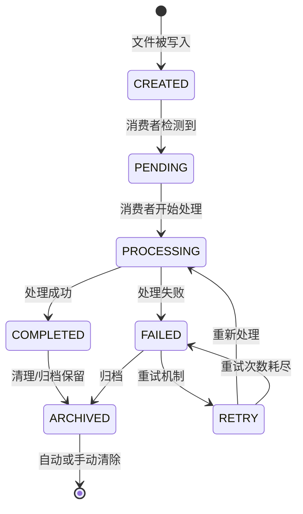

# 信号总线 Schema (Signal Bus)

> 墨枢系统文件级异步通信协议。
> 定义信号数据结构、生命周期、流向和fail-closed机制。

---

## 1. 设计原则

### 1.1 为什么用文件系统作为信号总线？

| 方案 | 问题 | 结论 |
|------|------|------|
| 飞书Webhook直连 | 回调不可靠、飞书API限流、重试逻辑复杂 | ❌ 放弃 |
| Redis消息队列 | 需要运维Redis实例、重启丢失风险、多Agent需要统一访问 | ❌ 放弃 |
| HTTP回调/REST | Agent间直接耦合、单点故障、需维护服务发现 | ❌ 放弃 |
| **文件系统信号总线** | **无需外部依赖、写入即持久化、原子文件操作、read验证可靠** | ✅ **采用** |

### 1.2 核心模型

```
Agent A ──(write JSON file)──> signals/ ──(read JSON file)──> Agent B
              ↑ 轮询                      ↑ 轮询
          Cron Scheduler              Cron Scheduler
```

- 每个信号是一个独立的JSON文件（或Markdown文件）
- Agent不直接通信，全部通过signals/目录中转
- 信号生产者写文件，信号消费者轮询检测
- 写入后必须read验证（写入验证规范）

---

## 2. 信号生命周期



**状态定义**:

| 状态 | 含义 | 存储方式 |
|------|------|---------|
| `CREATED` | 文件刚写入, 状态字段标记为 `CREATED` | JSON `status` 字段 |
| `PENDING` | 消费者已检测到但尚未开始处理 | 文件不变 |
| `PROCESSING` | 消费者正在处理中 | 可选写入中间文件 |
| `COMPLETED` | 处理完成 | 信号文件 `status="COMPLETED"` + `.done` 信号文件 |
| `FAILED` | 处理失败 | 信号文件 `status="FAILED"` + `.failed` 信号文件 |
| `RETRY` | 重试队列中 | 独立的 `_retry_{seq}_{agent}.json` |
| `ARCHIVED` | 已归档清理 | 信号文件移动到归档目录或删除 |

---

## 3. 信号目录结构与流向

```
signals/                           # 信号总线根目录
├── triggers/                      # 触发信号 (Agent执行入口)
│   ├── trigger_step2_{task_id}.json
│   ├── trigger_step4_{task_id}.json
│   ├── trigger_step5_{task_id}.json
│   └── ...  (Cron→Agent)
├── dispatch/                      # 分发信号 (事件驱动)
│   ├── meeting_trigger_{seq}.json
│   └── ...  (外部事件→墨涵→子Agent)
├── consensus/                     # 共识信号层 (Agent状态同步)
│   ├── heartbeat/                 # 心跳信号 (活性检测)
│   │   ├── moheng_hb_{seq}.json
│   │   ├── moheng_hb_{seq+1}.json
│   │   └── ...
│   └── ...  (Agent↔Agent)
├── signals/                       # 数据信号层 (数据传递)
│   ├── datacollection_{task_id}.json       # 玄知采集数据
│   ├── reportdraft_{task_id}.md            # 墨涵草稿
│   └── ...  (Agent→Agent)
├── _retry_{seq}_{agent}.json               # 重试信号 (错误恢复)
└── _lock_{resource}.lock                   # 分布式锁 (可选)
```

### 信号流向说明

```
玄知(XuanZhi)
   │ 写入 datacollection_{tid}.json
   ▼
signals/signals/
   │ 状态: READY
   ▼
墨涵(MoHan)/Dispatcher
   │ 写入 trigger_step2_{tid}.json
   ▼
signals/triggers/
   │ agent＝"moheng"
   ▼
墨衡(MoHeng) → 读取 → 分析 → 写入 structured_analysis_{tid}.json → 写入 .done
   │
   ▼
Dispatcher 轮询到 .done → 写入 trigger_step4_{tid}.json
   │
   ▼
墨衡(MoHeng) → 读取 → 审查 → 写入 review_feedback_{tid}.md → 写入 .done
   │
   ▼
Dispatcher 轮询到 .done → 写入 reportdraft_{tid}.md
   │
   ▼
墨涵(MoHan) → 汇总 → 发布飞书
```

---

## 4. JSON Schema 通用规范

### 4.1 所有信号文件的公共字段

```json
{
  "$schema": "http://json-schema.org/draft-07/schema#",
  "title": "MoShu Signal Base Schema",
  "description": "墨枢系统信号文件公共规范",
  "type": "object",
  "required": ["status", "task_id", "completed_time"],
  "properties": {
    "status": {
      "type": "string",
      "enum": ["CREATED", "PENDING", "PROCESSING", "READY", "COMPLETED", "FAILED", "ARCHIVED"],
      "description": "信号状态。READY: 数据就绪可供消费",
      "examples": ["READY"]
    },
    "task_id": {
      "type": "string",
      "description": "任务唯一标识符，用于关联同一条管线的所有信号",
      "pattern": "^[a-zA-Z0-9_-]+$",
      "examples": ["comm_fix_moheng_v4", "morning_20260515"]
    },
    "completed_time": {
      "type": "string",
      "format": "date-time",
      "description": "完成时间 (ISO 8601, +08:00 时区)",
      "examples": ["2026-05-15T08:15:00+08:00"]
    },
    "agent": {
      "type": "string",
      "description": "责任人Agent名称",
      "examples": ["moheng", "xuazhi", "mohan", "mochen"]
    },
    "error": {
      "type": "string",
      "description": "错误描述 (仅在 FAILED 状态时出现)",
      "examples": ["数据采集超时"]
    }
  }
}
```

### 4.2 数据采集信号 (datacollection_{task_id}.json)

```json
{
  "$schema": "...",
  "title": "DataCollection Signal",
  "type": "object",
  "required": ["status", "task_id", "agent", "data", "report_type", "date"],
  "properties": {
    "status": { "$ref": "#/$defs/common/status" },
    "task_id": { "$ref": "#/$defs/common/task_id" },
    "agent": { "const": "xuazhi" },
    "report_type": {
      "type": "string",
      "enum": ["morning", "midday"],
      "description": "报告类型: 晨报或午报"
    },
    "date": {
      "type": "string",
      "pattern": "^\\d{8}$",
      "description": "报告日期，格式 YYYYMMDD",
      "examples": ["20260515"]
    },
    "data": {
      "type": "object",
      "description": "玄知采集的结构化数据"
    },
    "marks": {
      "type": "object",
      "description": "玄知的初步判断标记"
    }
  }
}
```

---

## 5. Fail-Closed 设计

> **核心理念**: 当信号无法正常递送或处理时，系统必须"安全失败"而非"悄然降级"。

### 5.1 设计规则

| 场景 | 行为 | 依据 |
|------|------|------|
| 信号文件不存在 | 不执行对应任务，返回 FAILED | 无信号=无指令 |
| 信号状态 != READY | 不执行，等待或报错 | 信号未就绪不应消费 |
| 多次读取验证失败 | 写入 FAILED 文件 | 防止数据损坏导致静默错误 |
| 处理超时(20s心跳) | 其他Agent标记该Agent为offline | 心跳缺失=Agent死亡 |
| deliver.to 格式错误 | fail-closed: 不发送 | 避免消息丢失或错发 |
| 审查 verdict = FAIL | Kill Switch触发，终止管线 | 质�?�不通过不应发布 |

### 5.2 fail-closed 在编码中的体现

```python
# 示例: fail-closed delivery
if delivery_config.get("to", "").startswith("feishu:chat:"):
    # BUG: 应该用 "chat:" 而不是 "feishu:chat:" 前缀
    # fail-closed: 不发送，记录错误
    raise DeliveryError("Invalid delivery target format")
```

---

## 6. 已定义的信号类型清单

| 信号类型 | 文件名模式 | 所在目录 | 生产者 | 消费者 | 用途 |
|---------|-----------|---------|--------|--------|------|
| **数据采集** | `datacollection_{task_id}.json` | `signals/signals/` | 玄知 | 墨涵/Dispatcher | 玄知完成数据采集 |
| **Step2触发** | `trigger_step2_{task_id}.json` | `signals/triggers/` | Dispatcher | 墨衡 | 触发墨衡深度分析 |
| **Step4触发** | `trigger_step4_{task_id}.json` | `signals/triggers/` | Dispatcher | 墨衡 | 触发墨衡质量审查 |
| **Step5触发** | `trigger_step5_{task_id}.json` | `signals/triggers/` | Dispatcher | 墨涵 | 触发墨涵汇总发布 |
| **报告草稿** | `reportdraft_{task_id}.md` | `signals/signals/` | Dispatcher | 墨涵 | 墨涵汇总草稿 |
| **会议触发** | `meeting_trigger_{seq}.json` | `signals/dispatch/` | 外部事件→墨涵 | 墨衡 | 会议响应任务 |
| **会议响应** | `meeting_response_{seq}.json` | `agents/moheng/meeting_response/` | 墨衡 | 墨涵 | 墨衡对会议的响应 |
| **心跳** | `moheng_hb_{seq}.json` | `signals/consensus/heartbeat/` | 墨衡 | 所有Agent | 活性检测 |
| **完成信号** | `{task_id}_{agent}.done` | `pipeline/tasks/` | 任意Agent | Dispatcher | 任务完成确认 |
| **失败信号** | `{task_id}_{agent}.failed` | `pipeline/tasks/` | 任意Agent | Dispatcher | 任务失败确认 |
| **重试信号** | `_retry_{seq}_{agent}.json` | `signals/` | Dispatcher | 对应Agent | 失败重试指令 |
