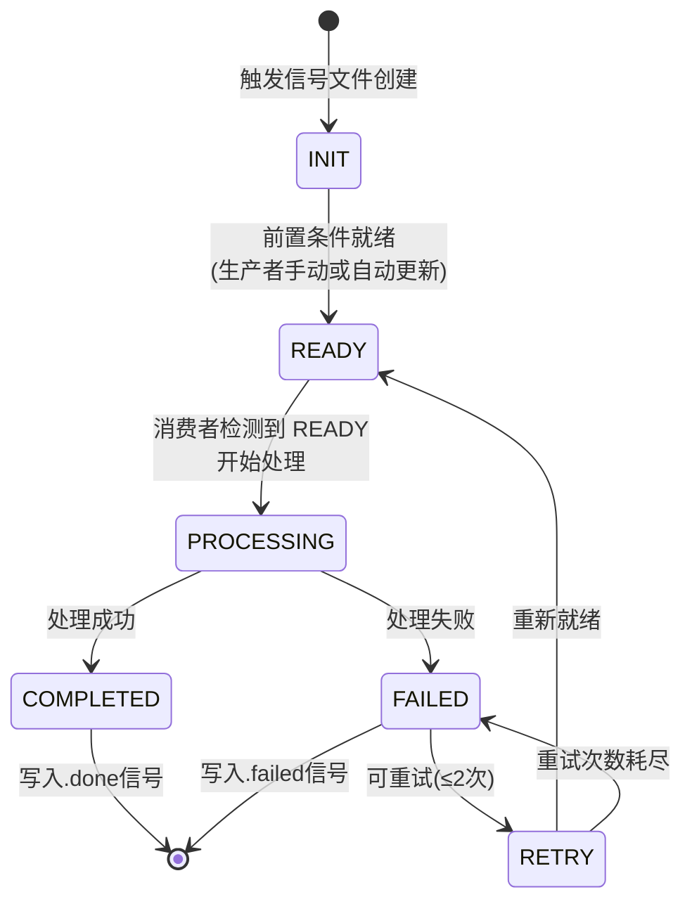
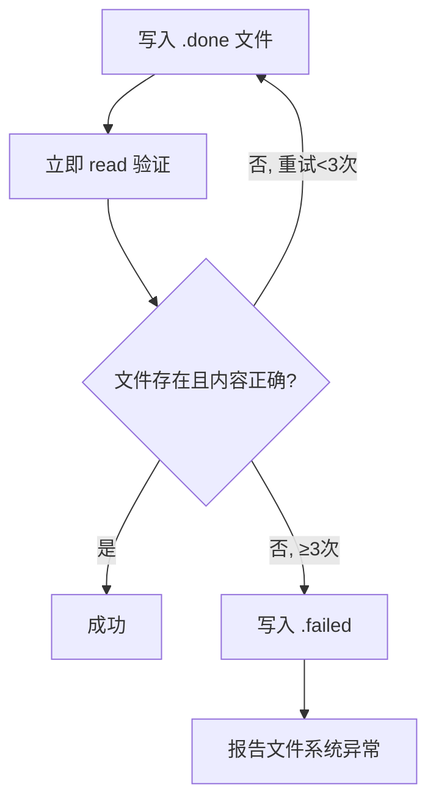

# 任务触发信号协议 (Task Signal Schema)

> 墨枢系统任务触发信号的完整协议规范。
> 定义 trigger_*.json 的字段约束、状态转换、幂等性和信号文件约定。

---

## 1. 触发信号基础结构

### 1.1 trigger_step*.json (通用模板)

```json
{
  "$schema": "http://json-schema.org/draft-07/schema#",
  "title": "Task Trigger Signal",
  "description": "墨枢任务触发信号，用于指示指定Agent执行某一步骤",
  "type": "object",
  "required": [
    "agent", "task_id", "report_type", "date", "status", "step"
  ],
  "properties": {
    "agent": {
      "type": "string",
      "description": "目标Agent名称",
      "enum": ["moheng", "xuazhi", "mohan", "mochen"],
      "examples": ["moheng"]
    },
    "task_id": {
      "type": "string",
      "description": "任务唯一标识符，跨步骤保持一致",
      "pattern": "^[a-zA-Z0-9_-]+$",
      "examples": ["comm_fix_moheng_v4", "morning_20260515"]
    },
    "report_type": {
      "type": "string",
      "description": "报告类型，决定写入路径",
      "enum": ["morning", "midday"]
    },
    "date": {
      "type": "string",
      "description": "报告日期，格式 YYYYMMDD",
      "pattern": "^\\d{8}$",
      "examples": ["20260515"]
    },
    "step": {
      "type": "integer",
      "description": "流水线步骤编号",
      "enum": [1, 2, 3, 4, 5],
      "examples": [2]
    },
    "status": {
      "type": "string",
      "description": "信号状态。消费者检测到 status==INIT 或 READY 时开始处理",
      "enum": ["INIT", "READY", "PROCESSING", "COMPLETED", "FAILED"]
    },
    "description": {
      "type": "string",
      "description": "任务描述，可选"
    },
    "created_time": {
      "type": "string",
      "format": "date-time",
      "description": "触发信号创建时间 (ISO 8601, +08:00)"
    },
    "completed_time": {
      "type": "string",
      "format": "date-time",
      "description": "任务完成时间 (ISO 8601, +08:00)"
    },
    "error": {
      "type": "string",
      "description": "错误描述，仅在 FAILED 时出现"
    }
  }
}
```

### 1.2 实际示例

**Step2 触发信号** (`trigger_step2_morning_20260515.json`):

```json
{
  "agent": "moheng",
  "task_id": "morning_20260515",
  "step": 2,
  "report_type": "morning",
  "date": "20260515",
  "status": "READY",
  "description": "墨衡深度分析 — 晨报2026-05-15",
  "created_time": "2026-05-15T07:15:00+08:00"
}
```

---

## 2. 状态转换图



### 状态含义

| 状态 | 含义 | 所有者 | 持续时间 |
|------|------|--------|---------|
| `INIT` | 信号文件刚创建，尚未就绪 | 生产者 | 短（秒级） |
| `READY` | 信号就绪，消费者可安全消费 | 生产者 | 直到消费者开始 |
| `PROCESSING` | 消费者正在处理中 | 消费者 | 几秒~几分钟 |
| `COMPLETED` | 处理成功 | 消费者 | 最终态 |
| `FAILED` | 处理失败 | 消费者 | 最终态 |

---

## 3. .done / .failed 信号文件协议

### 3.1 写入路径

```
pipeline/tasks/{task_id}_{agent}.done     # 成功的标志
pipeline/tasks/{task_id}_{agent}.failed   # 失败的标准
```

示例:
```
pipeline/tasks/morning_20260515_moheng.done
pipeline/tasks/comm_fix_moheng_v4_moheng.failed
```

### 3.2 写入规范

**.done 文件内容**:

```json
{
  "status": "COMPLETED",
  "task_id": "<task_id>",
  "step": 2,
  "agent": "moheng",
  "summary": "墨衡深度分析完成，产出见 structured_analysis_morning_20260515.json",
  "output_path": "reports/morning/20260515/structured_analysis_morning_20260515.json",
  "completed_time": "2026-05-15T07:28:00+08:00"
}
```

**.failed 文件内容**:

```json
{
  "status": "FAILED",
  "task_id": "<task_id>",
  "step": 2,
  "agent": "moheng",
  "error": "数据采集信号不存在或status!=READY",
  "completed_time": "2026-05-15T07:20:00+08:00"
}
```

### 3.3 互斥规则

- `.done` 和 `.failed` **不可同时存在**
- 写入 `.done` 后发现失败 → 先删除 `.done` 再写 `.failed`
- 写入 `.failed` 后发现已完成 → 不允许再写 `.done`
- 确保原子性: 先清理对立文件，再写入新文件

### 3.4 写入验证 (必须执行)



---

## 4. 幂等性保证

### 4.1 设计原则

> **同一 task_id 的同一步骤，在任何条件下不得被重复执行。**

### 4.2 实现方式

| 机制 | 说明 |
|------|------|
| **信号文件检查** | 消费者在开始处理前，先检查 `pipeline/tasks/` 下是否存在该 task_id+step 的 `.done` 或 `.failed` |
| **触发器文件独占** | 每个 trigger_*.json 只对应当前 task_id 的当前步骤，不轮询旧步骤 |
| **.done 即此步骤终止** | 一旦写入 `.done` 或 `.failed`，该步骤永不再触发 |
| **Cron 步进模式** | spawn方式调用时，§1.2 明确 "同一 task_id 的同一步骤不会重复执行" |
| **禁用并行写入** | Agent的同一个步骤，在发现 `.done` 后跳过所有后续触发 |

### 4.3 幂等检查伪代码

```python
def is_already_completed(task_id, agent, step):
    done_path = f"pipeline/tasks/{task_id}_{agent}.done"
    failed_path = f"pipeline/tasks/{task_id}_{agent}.failed"
    if os.path.exists(done_path):
        return True  # 已完成
    if os.path.exists(failed_path):
        return True  # 已失败过（不再重试）
    return False

def execute_step(task_id, agent, step):
    if is_already_completed(task_id, agent, step):
        print(f"SKIP: {task_id} step {step} already completed")
        return
    # 执行步骤...
```

---

## 5. 典型触发-完成时序

```
时间线 (晨报示例)
━━━━━━━━━━━━━━━━━━━━━━━━━━━━━━━━━━━━━━━━━━━━━━━━━

07:15  Dispatcher 写 trigger_step2_{tid}.json  (status=READY)
07:15  Moheng 轮询发现 → 开始 Step2 分析
07:28  Moheng 写 structured_analysis_{tid}.json
07:28  Moheng 写 pipeline/tasks/{tid}_moheng.done
07:29  Moheng 回复 Announce([DONE]:{tid})
07:29  Dispatcher 轮询到 .done → 写 trigger_step4_{tid}.json
07:30  Moheng 轮询发现 → 开始 Step4 审查
07:32  Moheng 写 review_feedback_{tid}.md  (verdict=PASS)
07:32  Moheng 写 pipeline/tasks/{tid}_moheng.done
07:32  Moheng 回复 Announce([DONE]:{tid})
━━━━━━━ 晨报管线推进到 Step5 ━━━━━━━
```

---

## 6. 路径规则汇总

| 信号类型 | 写入路径 | 读取路径 |
|---------|---------|---------|
| Step2触发 | `signals/triggers/trigger_step2_{task_id}.json` | 消费者轮询该目录 |
| Step4触发 | `signals/triggers/trigger_step4_{task_id}.json` | 消费者轮询该目录 |
| 数据采集 | `signals/signals/datacollection_{task_id}.json` | 消费者读取 |
| 结构化分析 | `reports/{report_type}/{date}/structured_analysis_{task_id}.json` | 下一个步骤消费者 |
| 审查反馈 | `reports/{report_type}/{date}/review_feedback_{task_id}.md` | 下一个步骤消费者 |
| 完成信号 | `pipeline/tasks/{task_id}_{agent}.done` | Dispatcher轮询 |
| 失败信号 | `pipeline/tasks/{task_id}_{agent}.failed` | Dispatcher轮询 |
