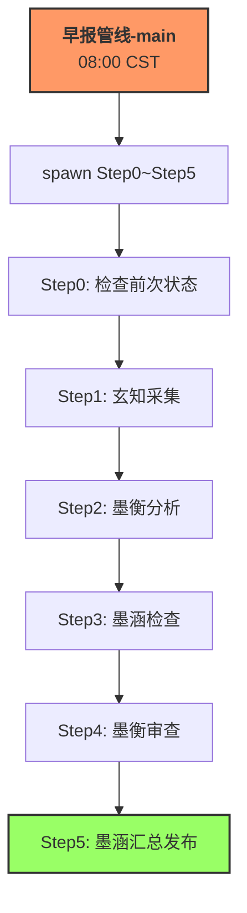

# Cron 调度清单

> 墨枢系统所有定时任务（Cron Job）一览表。
> **数据来源**: `openclaw cron list --json` (2026-05-15T16:41)

---

## 1. Cron 任务一览

| ID (简短) | 名称 | 调度表达式 (CST) | 时区 | Agent责任人 | 上级调用方 | 产出/触发路径 | 最近状态 | 连续失败次数 | 失败影响 |
|-----------|------|-----------------|------|-----------|-----------|-------------|---------|-----------|---------|
| `ce760f90` | 早报管线-main | `0 8 * * 1-5` | Asia/Shanghai | mochen | Cron | spawn子Agent完成管线; delivery→飞书群 | ⚠️ error | 1 | **P0** — 晨报断供 |
| `fc55ff83` | evening_report_runner | `50 19 * * 1-5` | Asia/Shanghai | mochen | Cron | 执行 evening_pipeline_runner.py | ✅ ok | 0 | **P1** — 晚报延迟 |
| `023fe199` | settlement_run | `0 19 * * 1-5` | Asia/Shanghai | mochen | Cron | 交易结算流程; delivery→飞书群 | ✅ ok | 0 | **P1** — 结算延迟 |
| `5deb39f3` | paper_trade_check_orders_19 | `0 19 * * 1-5` | Asia/Shanghai | mochen | Cron | 执行 check_orders_fill.py | ✅ ok | 0 | **P2** — 成交检查延迟 |
| `d70b5e52` | paper_trade_settle_backup | `0 19 * * 1-5` | Asia/Shanghai | mochen | Cron | 执行 settle_backup_cron.py | ⚠️ error | **3** | **P2** — 备份失败(不影响核心) |
| `78a31b11` | research_report_1905 | `5 19 * * 1-5` | (无) | mochen | Cron | research_daily_report.py; delivery→飞书群 | ✅ ok | 0 | **P2** — 研报延迟 |
| `8bbee552` | 每日日志归档02:00 | `0 2 * * *` | Asia/Shanghai | mochen | Cron | 日志归档到 logs/daily/; delivery→飞书群 | ⚠️ error | 2 | **P2** — 日志未归档 |
| `15ed3c94` | reports归档_03:00 | `0 3 * * *` | Asia/Shanghai | mochen | Cron | reports归档; delivery→飞书群 | ⚠️ error | **9** | **P2** — 报告未归档 |
| `a1b2c3d4` | logs_archiver | `0 3 * * 0` (周日) | Asia/Shanghai | mochen | Cron | 执行 logs_archiver.py; 无delivery | ✅ ok | 0 | **P2** — 日志压缩跳过 |
| `e0ec1279` | incoming_meta_scan | `0 21 * * *` | Asia/Shanghai | moheng | Cron | ① 执行 incoming_meta.py 生成 .meta.json<br/>② 执行 file_lifecycle register-incoming 登记到注册库 | — (无历史) | 0 | **P2** — meta未补全/注册库未更新 |

> **状态图例**: ✅ ok / ⚠️ error / ❌ fatal / — 未运行

---

## 2. 依赖关系图

### 2.1 交易时间线 (串行依赖)

```mermaid
graph LR
    A[settlement_run<br/>19:00] --> B[paper_trade_check_orders_19<br/>19:00(并行)]
    A --> C[paper_trade_settle_backup<br/>19:00(并行)]
    B --> D[research_report_1905<br/>19:05]
    D --> E[evening_report_runner<br/>19:50]
```

### 2.2 夜间维护时间线 (无强依赖, 可并行)


### 2.3 晨报管线 (串行依赖, P0级)



---

## 3. 并行/串行分组

### 串行链 (有前序依赖)

| 链 | 任务 | 调度时间 | 依赖 |
|----|------|---------|------|
| 晨报管线 | `早报管线-main` → Step0~Step5 (内部串行) | 08:00 CST | — |
| 盘后结算 | `settlement_run` → `paper_trade_check_orders_19` | 19:00 CST | 盘口关闭 |
| 盘后发布 | `research_report_1905` → `evening_report_runner` | 19:05→19:50 | 结算完成 |

### 并行组 (无交叉依赖)

| 组 | 任务 |
|----|------|
| **盘后结算(19:00)** | `settlement_run`, `paper_trade_settle_backup` (与check_orders并行) |
| **夜间维护(02:00~03:00)** | `每日日志归档`, `reports归档`, `logs_archiver(周日)` |

---

## 4. 故障快速响应

### 已出现问题

| Cron | 问题 | 连续失败 | 严重程度 | 建议操作 |
|------|------|---------|---------|---------|
| `reports归档_03:00` | 飞书delivery目标格式错误 | 9次 | P2 (功能降级) | 修复delivery.to配置 |
| `每日日志归档02:00` | 飞书消息发送失败 | 2次 | P2 (功能降级) | 检查消息路由 |
| `paper_trade_settle_backup` | 飞书delivery目标格式错误 | 3次 | P2 (不影响核心结算) | 修复delivery.to配置 |
| `早报管线-main` | 飞书delivery目标格式错误 | 1次 | **P0 (晨报断供)** | 紧急修复 delivery target |

### 最近失败共同根因

多个Cron的 `lastError` 显示 `"Delivering to Feishu requires target <chatId|user:openId|chat:chatId>"`，表明 `delivery.to` 配置使用了 `feishu:chat:` 前缀而非裸 `chat:` 前缀，或 `mode: announce` 在子session中无法从`last`解析出有效目标路由。

---

## 5. 调度配置参考

| 字段 | 说明 | 示例值 |
|------|------|--------|
| `id` | 唯一标识 | `ce760f90-3cd8-4594-a80a-0f7fb1743085` |
| `name` | 人工可读名称 | `早报管线-main` |
| `schedule.expr` | CRON表达式 | `0 8 * * 1-5` (周一到周五08:00) |
| `schedule.tz` | 时区 | `Asia/Shanghai` |
| `payload.kind` | 任务类型 | `agentTurn` (Agent对话触发) |
| `payload.message` | 提示词/指令 | `执行早报管线（主spawn子模式）...` |
| `sessionTarget` | 会话隔离 | `isolated` (独立session执行) |
| `wakeMode` | 唤醒模式 | `now` (立即执行) |
| `delivery.mode` | 产出投递 | `announce` (回告) / `none` (无投递) |
| `delivery.to` | 投递目标 | `feishu:chat:oc_72bacde2a63f824bd011718fbe58f48a` |

---

## 6. 文件生命周期管线 (File Lifecycle Pipeline)

> 文件从 incoming 缓冲区到注册库的全生命周期管理。

### 6.1 生命周期流程

```
incoming/test.py                     ← 原始数据文件
incoming/test.meta.json              ← 元数据（incoming_meta 自动生成）
↓ 每天 21:00 (incoming_meta_scan cron)
python -m src.utils.incoming_meta    ← 扫描并补全 .meta.json
python -m src.utils.file_lifecycle register-incoming  ← 登记到注册库
↓
registry/file_registry.db            ← SQLite 索引库（新增记录）
↓ 人工整理
python -m src.utils.file_lifecycle update \
    --path "incoming/20260515/test.py" \
    --final "automation_v2/test.py" \
    --status sorted \
    --category automation_v2 \
    --tags "fix"
```

### 6.2 file_lifecycle.py 子命令总览

| 子命令 | 功能 | 示例 |
|--------|------|------|
| `init` | 初始化数据库 | `python -m src.utils.file_lifecycle init` |
| `register-incoming` | 登记 incoming 文件到数据库 | `--date 20260515` / `--all-dates` / `--dry-run` |
| `scan-registry` | 生成统计报告（含孤儿检查） | `python -m src.utils.file_lifecycle scan-registry` |
| `search` | 多维度搜索 | `--filename fix --tag automation --keyword settlement` |
| `update` | 更新记录 | `--path <original> --final <dest> --status sorted --category <cat>` |
| `status` | 数据库概览 | `python -m src.utils.file_lifecycle status` |
| `export` | 导出 CSV | `python -m src.utils.file_lifecycle export` |

### 6.3 注册库字段

| 字段 | 类型 | 说明 |
|------|------|------|
| `id` | INTEGER PK | 自动递增 |
| `filename` | TEXT | 文件原名 |
| `original_path` | TEXT | incoming 下的完整路径（唯一索引） |
| `final_path` | TEXT | 入库后的完整路径 |
| `category` | TEXT | 分类（参考 VALID_CATEGORIES） |
| `status` | TEXT | `incoming` → `sorted` → `archived` → `deleted` |
| `created_at` | TEXT | 文件创建时间 |
| `imported_at` | TEXT | 登记入库时间 |
| `tags` | TEXT | 逗号分隔标签 |
| `note` | TEXT | 备注 |

### 6.4 注册库文件路径

- 数据库: `registry/file_registry.db`
- 代码: `src/utils/file_lifecycle.py`
- 测试: `tests/test_file_lifecycle.py`
