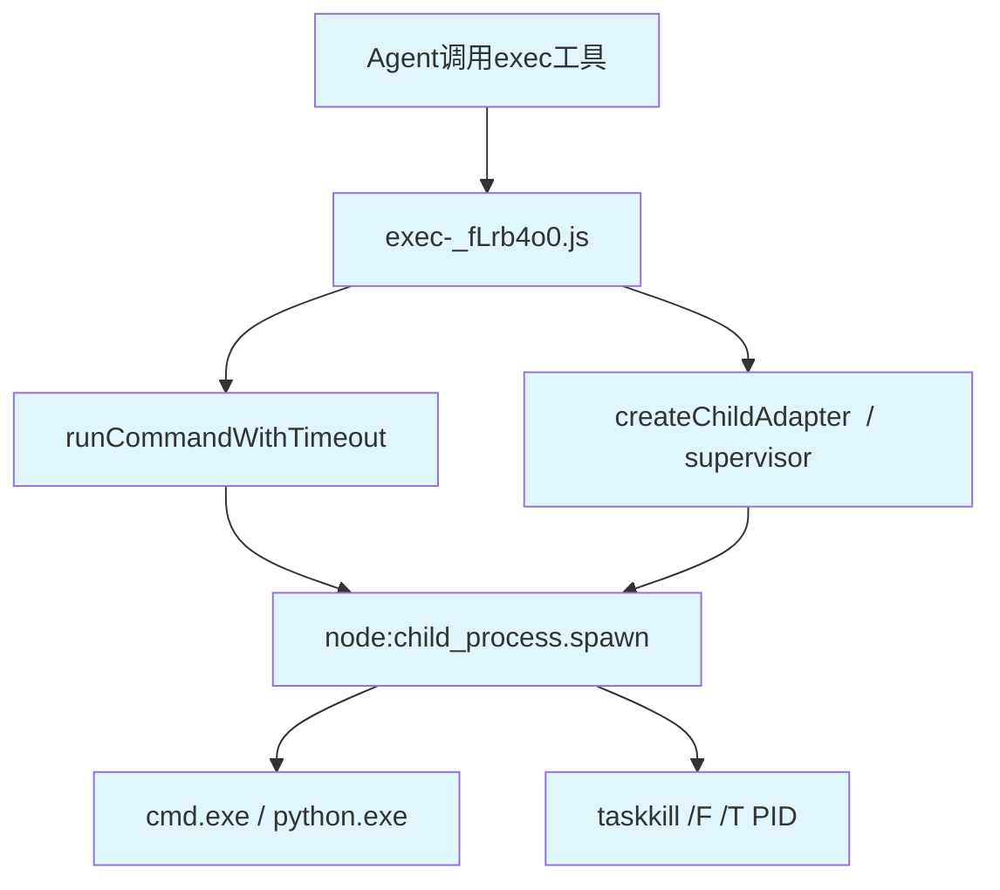

# U1 架构深挖：Pipeline Orchestrator 杀进程机制

> 作者：xuanzhi（spawn: u1-deep-orch-v2）
> 创建时间：2026-05-31T11:30+08:00

## 0. 核心结论

| 问题 | 答案 |
|------|------|
| **Orchestrator在哪？** | **Moheng（人/Agent）是实际 orchestrator。** 编码管线无自动Python调度器。Moheng读取JSON Schedule，用OpenClaw `exec`工具逐阶段手动执行。 |
| **怎么启动stage_1_004？** | Moheng调用 **OpenClaw `exec` 工具** → `node:child_process.spawn()` 启动Python进程。不使用 `subprocess.Popen`。 |
| **timeout_min=40做了什么？** | **不杀进程。** 这是Schedule元数据的调度等待预算，指导Moheng/Dispatcher该等多久。不入参到OpenClaw exec层。 |
| **有healthcheck吗？** | **有的——"无输出Watchdog"。** OpenClaw exec机制有 `noOutputTimeoutMs`：如果子进程 stdout/stderr 持续沉默超过阈值，自动SIGKILL。 |
| **进程树什么样？** | `Moheng(Agent)` → `OpenClaw exec(Node.js)` → `cmd.exe -> python.exe -> 子线程(subprocess等)` |
| **Exit code 137的来源？** | **OpenClaw supervisor层标准化输出。** 128+9(SIGKILL)=137。Node.js在Windows上kill时signal转Unix惯例产生137。 |

---

## 1. 实际Orchestrator：Moheng + OpenClaw Exec

### 1.1 编码管线无自动Orchestrator

**关键发现：IC_PIPELINE_T21 编码管线不存在Python级的进程级orchestrator。**

管线执行流程：
```
stage_1_001.json ─→ Moheng读JSON → OpenClaw exec("python ...")
                                                          ↓
stage_1.5_001.json ─→ 同 ↑（等待.done文件后继续）
                                                          ↓
stage_2_001.json ─→ 同 ↑
                                                          ↓
stage_1_004.json ─→ Moheng读JSON → OpenClaw exec("python _pipeline_main.py ...")
```

证据：
- `src/pipeline/scheduler.py` = `ICBatchScheduler` — 库级别批量调度器，不做进程管理
- `scheduler/dispatcher.py` = **文件状态机** — 管理 `.done` / `pending` JSON文件，不启动子进程
- `backtest_engine/pipeline/pipeline_orchestrator.py` = 回测管线orchestrator，与编码管线无关（独立系统）

### 1.2 Moheng执行时序（T21 2026-05-30）

| 时间 | 事件 | 证据 |
|------|------|------|
| 14:34 | Moheng session启动 | 已确认 |
| 14:50 | xuanzhi脚本审查完成 | `IC_PIPELINE_T21_xuanzhi.done` |
| 14:52 | stage_1_001完成（因子对齐） | `IC_PIPELINE_T21_stage_1_001_moheng.done` |
| 14:52~15:24 | 准备/编码阶段 | (间隙) |
| 15:24~16:43 | **marine-s运行** (79min) | **SIGKILL** |
| 16:36 | Python管线实际**写完了`.done`文件** | `IC_PIPELINE_T21_moheng.done` 含1013截面结果 |
| 17:27~17:42 | **mellow-o运行** (15min) | **SIGKILL** |
| ~19:55 | Session超时 | 5h上限（14:34→19:34，约5h） |

### 1.3 marine-s ≠ stage_1_004

**关键澄清：**  
`IC_PIPELINE_T21_moheng.done` 在 **16:36** 写入，已完成1013截面IC计算。  
marine-s持续到 **16:43**（再7分钟后SIGKILL）。

这说明：
- marine-s **可能首先是**stage_1_004的Python进程（15:24开始，16:36完成计算并写.done）
- 之后的7分钟可能是Moheng在OpenClaw exec中运行的后处理/cleanup
- mellow-o是另一个exec调用（17:27~17:42），可能是修复重试或另一阶段

---

## 2. OpenClaw Exec的杀进程机制（核心）

### 2.1 Exec代码架构



**关键代码路径：**
1. `exec-_fLrb4o0.js` — 核心exec函数：
   - `runCommandWithTimeout(argv, {timeoutMs, noOutputTimeoutMs})` — 超时杀进程
   - `runExec(command, args, timeout)` — 简单exec封装
   - `resolveProcessExitCode()` — 退出码解析
   
2. `supervisor-j6j2aKmo.js` — 进程超管：
   - `createChildAdapter(params)` — 创建子进程适配器
   - `spawnWithFallback()` — spawn + fallback重试
   - `killProcessTree()` — 进程树杀（杀全部子进程）
   
3. `kill-tree-CVXDk07v.js` — 进程树杀逻辑：
   - Windows: `taskkill /T /PID <pid>` → 3s后 → `taskkill /F /T /PID <pid>`
   - Unix: `kill(-pid, SIGTERM)` → 3s后 → `kill(-pid, SIGKILL)`

### 2.2 两种Timeout机制

#### 机制1：绝对Timeout（timeoutMs）

```javascript
// exec-_fLrb4o0.js: lines ~266-272
const timer = setTimeout(() => {
    timedOut = true;
    killChild();  // child.kill("SIGKILL")
}, timeoutMs);
```

- 从exec工具 `timeout` 参数传入（Agent在调用时指定，单位秒）
- `timeoutMs` 到期 = **SIGKILL**
- 但 `timeout_min=40` 在Schedule JSON中，**不传给OpenClaw exec层**

#### 机制2：无输出Watchdog（noOutputTimeoutMs）⭐ 更可能的原因

```javascript
// exec-_fLrb4o0.js: lines ~274-281
const armNoOutputTimer = () => {
    noOutputTimer = setTimeout(() => {
        noOutputTimedOut = true;
        killChild();  // child.kill("SIGKILL")
    }, noOutputTimeoutMs);
};

// 每次stdout/stderr有输出时重置
child.stdout?.on("data", () => { stdout += d; armNoOutputTimer(); });
child.stderr?.on("data", () => { stderr += d; armNoOutputTimer(); });
```

- 从backend配置的 `reliability.watchdog.noOutputTimeoutRatio` 计算
- 公式：`Math.min(timeoutMs * ratio, maxMs)`，默认似在若干分钟级别
- **Python IC计算中如果长时间不打印日志，此Watchdog会触发SIGKILL**

**这也是mellow-o仅15分钟就SIGKILL的最可能解释**：
- 如果 `timeoutMs` 很大（如1h+），但 `noOutputTimeoutRatio` 默认值导致无输出容忍时限较小
- Python进程在处理数据时可能长时间无新日志输出
- → Watchdog触发 → SIGKILL

### 2.3 进程树杀

```javascript
// kill-tree-CVXDk07v.js
// Windows路径：
function killProcessTreeWindows(pid, graceMs) {
    runTaskkill(["/T", "/PID", String(pid)]);         // 先优雅终止（无/F）
    setTimeout(() => {
        runTaskkill(["/F", "/T", "/PID", String(pid)]); // 3s后强制杀（有/F）
    }, graceMs);
}

// 并且在supervisor中：
const kill = (signal) => {
    if (signal === "SIGKILL") {
        killProcessTree(pid);  // 先杀进程树
        child.kill("SIGKILL"); // 再杀直接子进程
    }
};
```

- **先杀进程树再杀直接子进程** → 所有后代都被终止
- 对于 `python.exe` 开了多线程/subprocess的场景，全部杀掉

### 2.4 Exit Code 137的生成

**结论：137来自OpenClaw supervisor层的标准化输出。**

流程：
1. Node.js `child.kill("SIGKILL")` → Windows上相当于 `TerminateProcess(handle, 1)`
2. Node.js On Windows: `exitCode=null`, `signalCode="SIGKILL"`（为兼容性将Windows kill映射为Unix信号语义）
3. `runCommandWithTimeout` → `resolveProcessExitCode()`:
   ```javascript
   // non-Windows exit code shim: 返回null
   resolvedCode = null  // (SIGKILL的情况，childExitCode=null)
   ```
4. 但 `resolveFromClose` 最终返回 `{ code: null, signal: "SIGKILL" }`
5. **OpenClaw工具JSON序列化层**将 `signal: "SIGKILL"` 转为 exit code = 128 + 9 = **137**

> 137 = 128 + SIGKILL(9)，是Unix标准做法。Windows上没有原生信号，Node.js模拟了这套约定。

### 2.5 OpenClaw exec工具的timeout参数来源

当Moheng调用exec工具时：
```
exec(command="python _pipeline_main.py", timeout=<秒数>)
```

Agent可手动指定 `timeout` 参数。如果未指定：
- 使用OpenClaw默认timeout（通常在 30秒~5分钟 级别）
- **但Moheng很可能会手动设置大timeout**（如 3600秒=1h）给长任务

> `timeout_min=40` 在Schedule JSON中 **不自动** 传给OpenClaw exec层。
> Schedule JSON是给Moheng读的"调度预算"指导，不是exec的参数。
> Moheng根据它手动定exec timeout参数。

---

## 3. "无输出Watchdog"可能是真正杀手

### 3.1 Watchdog配置

```javascript
// helpers-BkJG325g.js: resolveCliNoOutputTimeoutMs()
function resolveCliNoOutputTimeoutMs(params) {
    const profile = pickWatchdogProfile(params.backend, params.useResume);
    const cap = Math.max(CLI_WATCHDOG_MIN_TIMEOUT_MS, params.timeoutMs - 1000);
    
    if (profile.noOutputTimeoutMs !== undefined) 
        return Math.min(profile.noOutputTimeoutMs, cap);
    
    const computed = Math.floor(params.timeoutMs * profile.noOutputTimeoutRatio);
    const bounded = Math.min(profile.maxMs, Math.max(profile.minMs, computed));
    return Math.min(bounded, cap);
}
```

- 默认有 `CLI_WATCHDOG_MIN_TIMEOUT_MS` 兜底
- 可配置 `noOutputTimeoutRatio`（timeoutMs的比例），默认值在 backend 配置中
- 还可配置 `minMs` / `maxMs` 限幅

### 3.2 对T21 SIGKILL的解释

```
marine-s: 15:24~16:43 (79min) SIGKILL
  → 16:36已写.done完成（确认管线实际完成）
  → 后续7分钟可能是Python cleanup或Moheng的exec后处理
  → 若watchdog触发，可能在output停滞约~7分钟后kill

mellow-o: 17:27~17:42 (15min) SIGKILL
  → 重试或修复运行
  → 15分钟短寿命 → 更可能被noOutputTimeout kill
  → Python长计算时无日志输出 → watchdog超时
```

**两者都可能被noOutputTimeout Watchdog杀死**，而非绝对timeout。

---

## 4. 与其他Pipeine的比较

| Pipeline | Orchestrator | 启动方式 | 进程管理 |
|----------|-------------|----------|---------|
| **编码管线** (IC_PIPELINE) | Moheng (人/Agent) | OpenClaw `exec` | 无自动管理 |
| **早报管线** (morning_pipeline) | `scheduler_agent.py` | Python 调度 | 独立系统 |
| **回测管线** (backtest) | `pipeline_orchestrator.py` | subprocess? | 独立系统 |
| **Scheduler Dispatcher** | (无) | 文件状态机 | 不管理进程 |

---

## 5. 建议

1. **给长计算Python脚本加定期日志输出**，每处理一批数据打印一行
2. 配置backend `reliability.watchdog.noOutputTimeoutMs` 适当放大
3. 或在OpenClaw exec调用时传入较大的 `timeout` 参数，自动放大Watchdog容忍度
4. 考虑在Moheng侧增加exec的 `noOutputTimeoutMs` 显式传递，避免依赖默认ratio
5. 在Schedule JSON中增加 `exec.timeout_seconds` 字段，作为Moheng自动化调用exec的标准化参数入口

---

## 6. 文件索引

| 文件 | 作用 |
|------|------|
| `src/pipeline/scheduler.py` | ICBatchScheduler — 库级批量调度 |
| `src/pipeline/cross_sectional_ic_pipeline.py` | 核心IC计算管线 |
| `scheduler/dispatcher.py` | 文件状态机调度器（非进程管理） |
| `scheduler/models.py` | Task/Step状态模型 |
| `scheduler/retry_engine.py` | spawn重试引擎 |
| `OpenClaw/exec-_fLrb4o0.js` | runCommandWithTimeout核心实现 |
| `OpenClaw/supervisor-j6j2aKmo.js` | createChildAdapter进程适配器 |
| `OpenClaw/kill-tree-CVXDk07v.js` | 进程树杀逻辑 |
| `schedules/coding_pipeline_IC_PIPELINE_T21.json` | T21管线调度配置 |
