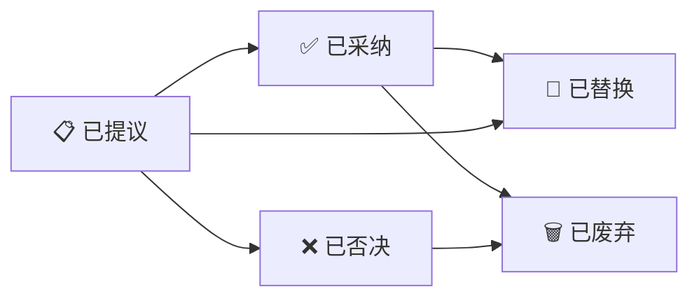

# ADR-000: [标题 — 决策名称]

> **领域**: [基础设施 / 通信协议 / 数据模型 / 安全 / DevOps]
> **状态**: [已采纳 ✅ / 已提议 📋 / 已否决 ❌ / 已废弃 🗑️ / 已替换 🔄]
> **日期**: YYYY-MM-DD
> **决策者**: [做出决策的人/Agent]

---

## 问题

用一句话描述需要做决策的问题。

(1-2段，说明问题的背景、触发条件、为什么需要做这个决策)

---

## 上下文

描述决策时的环境约束、已知条件、团队偏好等。

- 系统环境: [Windows/Linux/混合]
- 可用资源: [人、工具、时间]
- 约束条件: [性能要求、兼容性、运维成本...]
- 其他:
  - ...
  - ...

---

## 决策

描述最终选择的方案，以及为什么。

### 具体实现

1. [实现要点1]
2. [实现要点2]
3. ...

### 额外工程保证（可选）

- [保证措施1]
- [保证措施2]

---

## 放弃方案

| 方案 | 放弃原因 |
|------|---------|
| [方案A] | [原因] |
| [方案B] | [原因] |
| ... | ... |

---

## 后果

### 正面

- ✅ [正面影响1]
- ✅ [正面影响2]
- ...

### 负面

- ❌ [负面影响1]
- ❌ [负面影响2]
- ...

### 缓解措施（可选）

1. [缓解方案1]
2. [缓解方案2]

---

## 相关文档

| 文档 | 路径 |
|------|------|
| [文档名] | [路径] |
| [文档名] | [路径] |

---

## ADR 编写指南

### 什么是 ADR？

ADR (Architecture Decision Record) 是架构决策记录。每当团队做出一个重要的技术决策时，记录这个决策以及其上下文、备选方案和后果。

### 何时写 ADR

- 引入新框架、库、工具
- 改变系统架构或通信方式
- 选择数据模型或协议
- 任何影响系统长期演进的决策

### ADR 生命周期

### 编号规则

- `ADR-NNN-description-slug.md`
- NNN 从 001 开始递增，不重复使用
- 可以使用主题前缀分组，如 `ADR-001-signal-bus.md`
