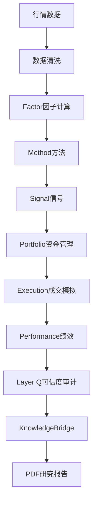

<!--

author: 墨涵（主笔）

contributors: 墨衡（架构/数据流）、墨萱（可验证性/Layer Q）、玄知（研究路线/未来方向）

created_time: 2026-05-20T15:55+08:00

version: v1.0

-->


# Mozhi 回测研究系统使用指南


> **从数据 → 信号 → 回测 → 审计 → 知识沉淀 的完整研究流程**


---


**首要读者：** 策略研究者

**核心原则：** 这不是一份工程文档。这是系统如何理解市场、如何帮你做研究的说明书。


---


## 目录


1. [系统是干什么的](#第1章-系统是干什么的)

2. [系统怎么跑一趟研究](#第2章-系统怎么跑一趟研究)

3. [当前你能研究什么](#第3章-当前你能研究什么)

4. [动手之前要想好的事](#第4章-动手之前要想好的事)

5. [每个方法怎么用](#第5章-每个方法怎么用)

6. [报告怎么看](#第6章-报告怎么看)

7. [怎么判断一个研究可信](#第7章-怎么判断一个研究可信)

8. [研究结果怎么变成知识](#第8章-研究结果怎么变成知识)

9. [下一步研究什么](#第9章-下一步研究什么)
10. [一次完整研究是怎么完成的](#第10章-一次完整研究是怎么完成的)
11. [失败研究档案馆](#第11章-失败研究档案馆)
12. [研究路线图](#第12章-研究路线图)


---


# 第1章 系统是干什么的


## 1.1 系统目标


Mozhi 是一套**量化研究方法论平台**，不是一个"跑策略、出数字、看收益"的回测工具。


它的核心使命很简单：**帮你系统地验证一个交易想法是否真的站得住脚。**


具体来说，这个系统能帮你做五件事：


| 目标 | 一句话说明 |

|:-----|:-----------|

| 验证趋势交易 | MA Cross / MACD 这类趋势方法到底有没有用、在什么市场有用 |

| 分析量价行为 | 通过 VWAP、Volume Profile 理解资金在干什么 |

| 审核心得 | 不只是看收益，还要看收益是怎么来的——是本事还是运气 |

| 沉淀经验 | 每次研究结果都存下来，下次可以直接翻旧账 |

| 避坑 | 系统自己会告诉你"这个结论不可信" |


## 1.2 系统不做什么


知道系统的边界比知道它能做什么更重要。


- **不做高频交易** — 目标市场是日线及以上级别，不研究微秒级的东西

- **不做自动下单** — 产出的是研究结论和信号建议，不是交易指令

- **不做黑盒预测** — 所有方法都有可解释的技术逻辑，不依赖深度学习猜股价

- **不承诺赚钱** — 不输出"必赚策略"，每一份报告都附带可信度评估


> 把 Mozhi 理解成一台显微镜，而不是一台印钞机，你就能用好它。


## 1.3 三个核心理念


### ① 研究优先


意思是：**先证明一个市场行为真实存在，再谈怎么用它赚钱。**


每一份报告的第一优先级是回答"这个规律是否存在"，而不是"赚了多少"。参数选择、周期选择都要有道理，不能因为"这样回测好看"。


### ② Layer Q 审计


系统不只看收益率曲线有多漂亮，它追问的是：


- 这个策略在不同市场状态下稳不稳？

- 是不是只在牛市有用？

- 最优参数是不是一个"孤峰"（参数稍微变一下就崩了）？

- 换了时间段还灵不灵？


一句话：**一个策略值不值得信任，看的是它最差的时候你受不受得了，不是它最好的时候有多光鲜。**


### ③ 研究结果必须沉淀


Mozhi 不是跑一次就扔掉的东西。每次研究的结论通过 KnowledgeBridge 进知识库，成为下一次研究的基础。


```

研究 → 结论 → 知识积累 → 新研究

```


你今天做的 MA Cross 回测，它的最优参数、已失效条件、适用市场状态，都会存下来。六个月后当你重新考虑这个策略时，系统会告诉你：**"上次发现这个参数的稳定性评分是 C 级，建议调一下。"**


---


# 第2章 系统怎么跑一趟研究


这章画一张全景图，让你知道一笔数据从行情到最终报告，经过了哪些步骤。


## 2.1 全流程数据流图





**记住这张图。** 以后你看报告、调参数、排错，脑子里就按这条链路想。


## 2.2 每一层在干什么


### 行情数据层

**输入：** 日线行情、成交量、成交额、VWAP逐笔、龙虎榜、Level-2逐笔

**作用：** 提供原始市场行为记录。系统不做加工，只做标准化对齐。


### 数据清洗层

**作用：** 确保后续分析基于干净数据。包括对齐时间轴、处理停牌缺失、检测异常值、评估数据质量。


### Factor因子层

**作用：** 把原始行情转化为可分析的技术指标。因子是系统理解市场的"词汇"。


| 因子 | 用途 |

|:-----|:------|

| MA | 趋势识别 |

| MACD | 动量研判 |

| ATR | 波动率度量 |

| VWAP | 成本基准 |

| OBV | 资金流分析 |

| Volume Profile | 成交密集区 |

| RSI | 超买超卖 |

| Bollinger | 波动通道 |


所有因子有统一的注册和缓存机制，同参数不重复计算。


### Method方法层

**作用：** 把因子组合成具体的交易观点。方法是系统的"语法"。


- MACD金叉 → 判断趋势向上

- RSI超卖 → 判断反转机会

- Wyckoff吸筹 → 判断主力建仓


当前支持的 Method 见第5章。


### Signal信号层

**作用：** 输出结构化的研究结论信号。这是整个系统最重要的数据合约。


每个信号 8 个核心字段：


| 字段 | 说明 | 示例 |

|:-----|:------|:------|

| signal_id | 全局唯一ID | `a1b2c3d4-...` |

| symbol | 标的 | `601857` |

| direction | 方向 | `BUY / SELL / HOLD` |

| confidence | 置信度 0~1 | `0.78` |

| horizon | 持有期 | `short / mid / long` |

| signal_type | 类别 | `trend / reversal / grid` |

| timestamp | 时间戳 | ISO 8601 |

| protocol_version | 版本 | `1.0` |


signal 通过 13 条验证规则，非法字段自动拦截。这不只是技术规范——这是把一个观点"关进契约"的手段，让输出的研究结论可以被独立验证。


### Portfolio资金管理层

**作用：** 根据信号配置资金。由 PortfolioManager 执行，决定仓位比例、多信号间分散、风险预算。


### Execution成交模拟层

**作用：** 模拟真实成交成本。考虑滑点、冲击成本、流动性限制。


**注意：** 很多看起来漂亮的策略经过这一层，收益会缩水 30%~50%。如果你只看回测不看成交模拟，你大概率会高估策略。


### Performance绩效统计层

**作用：** 计算标准化绩效指标。20+ 个指标，涵盖收益类（3）、风险类（5）、风险调整类（3）、交易类（4）、恢复类（3）、信息类（2）。


### Layer Q可信度审计层

**作用：** 判断研究结论是否可信。这是本系统最值钱的一层。


它会判断：是否过拟合、是否参数尖峰、是否跨周期失效、是否只在牛市有效。输出 A/B/C/D/F 五级可信度评分。


完整内容见第7章。


### KnowledgeBridge知识沉淀层

**作用：** 把一次性的回测结果变成长期知识资产。见第8章。


### PDF研究报告

系统生成结构化的研究报告，包含净值曲线、热力图、回撤图、信号分布图和知识分析。


---


# 第3章 当前你能研究什么


## 3.1 研究方向总览


```

┌─────────────────────────────────────────────────────┐

│                    趋势研究                          │

│  MA Cross  │  MACD  │  Bollinger  │  Wyckoff(部分)  │

│  可信度:B   │  B     │  实验级      │  C               │

├─────────────────────────────────────────────────────┤

│                    量价结构                          │

│  VWAP  │  Volume Profile  │  Wyckoff(量价)  │  OBV  │

│  可信度:B  │  B+             │  C               │  实验级 │

├─────────────────────────────────────────────────────┤

│                    网格交易                          │

│  区间套利 │ 边界管理 │ 波动率自适应间距               │

│  可信度:B                                              │

├─────────────────────────────────────────────────────┤

│                    市场状态(Regime)                   │

│  TREND_UP / OSCILLATION / PANIC / LOW_VOL           │

│  RegimeAnalyzer → 策略适用性判定                       │

└─────────────────────────────────────────────────────┘

```


## 3.2 各方向说明


### 趋势研究

研究市场趋势的启动、持续和结束。趋势方法是系统性资金最常用的方法体系。


### 量价结构研究

研究成交量和价格之间的关系，理解资金行为。Wyckoff 方法横跨趋势和量价两个方向，在第5章中统一解释。


### 网格交易研究

在震荡市中通过网格区间交易获利。


### Regime研究

系统将市场状态分为四种：TREND_UP / OSCILLATION / PANIC / LOW_VOL。研究的核心问题是：**什么策略适合什么市场状态？**


### 参数稳定性研究

比"找到最优参数"更重要的是证明参数稳定。通过参数岛 vs 参数尖峰判别、WalkForward 测试来验证。


### 执行质量研究

研究策略在实际交易中的可行性：容量、滑点敏感性、成交冲击。


## 3.3 当前盲区


目前系统尚未覆盖（知道这些有助于你理解系统边界）：


1. **策略组合研究** — 不同方法之间的相关性、低相关组合构建、动态权重调整，尚无模块覆盖

2. **标的选择研究** — 不涉及"应该研究哪个标的"，需要研究者自己决定

3. **行为偏差研究** — Layer Q 只审策略本身，不审研究者自身的行为偏差


---


# 第4章 动手之前要想好的事


## 4.1 数据准备


开始研究前确认：

- 标的日线行情（至少覆盖 3-5 年）

- 成交量与成交额

- Regime 标签（由 RegimeAnalyzer 预计算）


系统使用 DataLoader 和 DataFiller 自动加载对齐数据。


## 4.2 明确研究目标


**研究开始前，用一句话写清楚你想验证什么。**


| ❌ 错误的目标 | ✅ 正确的目标 |

|:--------------|:--------------|

| "找赚钱参数" | "验证 MA(5,20) 金叉死叉在 601857 上是否长期有效" |

| "试试网格" | "网格间距 2% 在震荡市中是否具有正期望值" |

| "MACD 能不能用" | "MACD(12,26,9) 金叉在 TREND_UP 中的胜率是否显著高于 50%" |


**目标越具体，结论越有价值。**


## 4.3 选择研究窗口


| 类型 | 推荐 | 说明 |

|:-----|:------|:------|

| 快速验证 | 3 个月 | 初步判断值不值得深入 |

| 稳定性测试 | 1 年 | 至少覆盖一个完整市场状态周期 |

| 可信度确认 | 3-5 年 | 覆盖多个牛熊周期 |


**规则：** 窗口少于 3 年，Layer Q 会自动降低可信度等级。


## 4.4 先定义失败条件


在开始之前就问自己：**什么样的结果能说明这个方法是无效的？**


示例：

- "若 3 年窗口总收益归零，则判定无效"

- "若 WalkForward R 值低于 0.02，则判定参数不稳定"

- "若只在 TREND_UP 有效而在其他三种 Regime 中亏损，则判定为市场状态依赖性强"


这样做的好处是：你的研究目标从"找赚钱策略"变成**"检验一个假设是否成立"**。后者才是科学的方法论。

> 💡 **提示：** 系统本身会自动完成六项存在性检查（见 §7.5 ExistenceValidator），包括最小交易数、多年度覆盖、信号密度等。你的自定义失败条件和系统的自动检查是互补的——你定义研究假设层面的失败条件，系统确保数据层面的统计显著性。


---


# 第5章 每个方法怎么用


本章统一格式介绍当前支持的所有技术分析方法。每种都包含核心思想、信号逻辑、适合/不适合的市场、常见失效模式、怎么看报告、当前可信度评级。

> 💡 **注意：** 本章每个方法自带"可信度"标签（如"B级"），这是基于开发完成度和验证次数的**方法成熟度评级**，并非 §7.3 Layer Q 对具体策略/参数组合的评级。Layer Q 是针对某次特定回测的——同一个方法在不同标的上可能有完全不同评级。两种"可信度"是概念维度不同的两个体系。


---


## MA Cross（移动平均线交叉）


**核心思想：** 趋势跟随。短期均线上穿长期均线 = 趋势启动。


**使用因子：** MA（移动平均线）


**信号逻辑：**

```

短期均线上穿长期均线 → BUY

短期均线下穿长期均线 → SELL

```


**适合：** TREND_UP（趋势明确的上升市场）

**不适合：** OSCILLATION（震荡市，反复假突破）、PANIC（恐慌下跌，信号严重滞后）


**常见失效模式：** ①假突破（金叉后快速反转）②高频震荡（均线周期过短时频繁交叉）③滞后性（快速反转时跟不上市场）


**报告里怎么看：** 到 §6（趋势质量）确认信号分布是否合理；到 Layer Q 参数稳定性检查，看不同均线参数组合下的收益是否连续


**可信度：B 级（中等稳定）** —在趋势明确的标的中稳定，震荡市中外加确认信号更可靠。


---


## MACD（指数平滑移动平均线）


**核心思想：** 动量跟随。通过快慢 EMA 差值判断趋势动能。


**使用因子：** MACD（快慢 EMA 差值）、Signal Line（信号线 EMA）、Histogram（柱状图）


**信号逻辑：**

```

DIF 上穿 DEA → BUY

DIF 下穿 DEA → SELL

Histogram 由负转正 → 动量确认

```


**适合：** TREND_UP（趋势延续）、OSCILLATION（底背离/顶背离可做反转参考）

**不适合：** PANIC（极速下跌中原背离不可靠）


**常见失效模式：** ①假金叉（动量不足就反转）②背离不反转（趋势太强背离钝化）③参数敏感


**报告里怎么看：** 到 §7.3（Q3 Regime 适配维度）了解策略在不同市场状态下的表现差异；到 Layer Q 参数稳定性检查确认参数是否敏感


**可信度：B 级（中等稳定）**


---


## Wyckoff（量价行为分析）


**核心思想：** 通过成交量模式识别主力资金的吸筹和派发阶段。这是一个横跨趋势识别和量价行为分析的方法。


**使用因子：** 成交量（Volume）、价格（Price）、Bar 结构（高/低/收）


**信号逻辑：**

```

吸筹区（SCAR/AR/LPS 阶段）→ 识别为上升趋势酝酿

派发区（BC/AR/UTAD 阶段）→ 识别为下跌风险

```

Wyckoff 的四种形态：吸筹（Accumulation）、再吸筹（Re-Accumulation）、派发（Distribution）、再派发（Re-Distribution）


**适合：** 所有市场状态（不同状态下适用不同形态）

**不适合：** 极端单边行情（趋势本身盖过了量价结构）


**常见失效模式：** ①形态识别主观性强（量化后的版本可能漏掉关键特征）②成交量数据质量影响大


**报告里怎么看：** 到 Layer Q 的 Regime 一致性检查，看不同市场状态下形态识别的准确率


**可信度：C 级（中等但待完善）** — 量化的可靠性取决于成交量数据和形态识别阈值的选择。


---


## VWAP（成交量加权平均价）


**核心思想：** VWAP 是机构资金的持仓成本线。价格偏离 VWAP 的程度反映了当前价格相对于机构成本的偏移。


**使用因子：** VWAP（成交量加权平均价）、成交量（Volume）


**信号逻辑：**

```

价格远高于 VWAP → 机构浮盈，可能止盈

价格远低于 VWAP → 机构浮亏，可能有支撑

VWAP 方向向上 → 机构看多

VWAP 方向向下 → 机构看空

```


**适合：** 大盘蓝筹（机构主导的标的）、趋势市中确认趋势

**不适合：** 小盘股（机构参与度低）、极端行情（VWAP 滞后）


**常见失效模式：** ①VWAP 反应滞后于价格 ②做成交量加权样本周期不同结果差异大


**报告里怎么看：** 到 §6（容量与成交质量）确认 VWAP 在不同滑点假设下的稳定性


**可信度：B 级（中等稳定）** — VWAP 是机构持仓的有效代理但本身滞后。


---


## Grid（网格交易）


**核心思想：** 在震荡市中通过设定上下边界，价格跌到低位买入、涨到高位卖出的策略。


**使用因子：** 价格（Price）、波动率指标（用于自适应间距）


**信号逻辑：**

```

价格触及网格下线 → BUY（在该位置挂买单）

价格触及网格上线 → SELL（在该位置挂卖单）

价格在网格内波动 → 等待

```


**适合：** OSCILLATION（区间震荡市，这是网格策略的本命市场）

**不适合：** TREND_UP（网格卖完就涨，踏空）、PANIC（网格买入后继续下跌，被套）


**常见失效模式：** ①趋势市中大幅踏空或套牢 ②网格间距过小被手续费吞噬收益 ③突发跳空突破网格边界


**报告里怎么看：** 到 Layer Q 的 Regime 一致性检查，确认网格收益是否确实来自震荡市而非牛市


**可信度：B 级（中等稳定）** — 在震荡市中有效，但必须在正确的市场状态下使用。


---


## RSI（相对强弱指数）


**核心思想：** 超买超卖反转。当 RSI 进入极端区域，市场可能反向运动。


**使用因子：** RSI（相对强弱指数）、价格（Price）


**信号逻辑：**

```

RSI 低于超卖线（通常 30）且回升 → BUY

RSI 高于超买线（通常 70）且回落 → SELL

```


**适合：** OSCILLATION（区间波动中反转信号有效）、PANIC（恐慌末期超卖后的报复性反弹）

**不适合：** 强势单边趋势（超买后就继续涨，超卖后就继续跌）


**常见失效模式：** ①强势趋势中"超买还涨"、"超卖还跌" ②参数选择不合理（14 日的传统参数在 A 股的适用性待验证）③假背离（RSI 背离但价格不反转）


**报告里怎么看：** 到 Layer Q 参数稳定性检查，看 RSI 周期参数（14/7/21等）变化时的收益稳定性


**可信度：C 级（中等但依赖参数选择）** — 在趋势确认后的震荡区间中较有效，不能单独作为决策依据。


---


## Volume Profile（成交量分布）


**核心思想：** 通过分析交易量在价格轴上的分布，找到成交最密集的价格区域，这些区域通常有较强的支撑或阻力作用。


**使用因子：** Volume Profile（成交量分布）、成交量（Volume）、价格（Price）


**信号逻辑：**

```

价格位于高成交量节点（POC）上方 → 支撑确认

价格跌破高成交量节点 → 支撑转化为阻力

高成交量节点上方运行 → 多头强势

高成交量节点下方运行 → 空头强势

```


**适合：** 确定关键支撑阻力位、区间交易

**不适合：** 高频短线（Volume Profile 适合日线级别以上，太短的时间周期意义不大）


**常见失效模式：** ①成交密集区被突破后就不再有参考价值 ②单个标的的成交量分布代表性不足


**报告里怎么看：** 到 §6（容量与成交质量）确认成交密集区的稳定性；到 Layer Q 的 Regime 一致性看不同市场状态下分布是否变化


**可信度：B+ 级（较稳定）** — 有利于识别关键价格区间，但建议与趋势确认方法配合使用。


---


## Bollinger（布林带）


**核心思想：** 价格在标准差通道内运动，通道的宽度反映了波动率。


**使用因子：** 移动平均线（MA）、标准差（StdDev）、价格（Price）


**信号逻辑：**

```

价格接触上轨并回落 → 可能的卖出信号（超买）

价格接触下轨并回升 → 可能的买入信号（超卖）

通道收窄 → 波动率下降，突破前兆

通道扩张 → 波动率上升，趋势信号增强

```


**适合：** 波动率周期性变化的标的、趋势突破识别

**不适合：** 低波动率标的中通道太窄、单边趋势中容易逆势操作


**常见失效模式：** ①极端趋势中通道持续扩张，"突破回调"的逻辑失效 ②波动率急剧变化时通道宽度调节滞后


**报告里怎么看：** 到 Layer Q 参数稳定性检查，看不同标准差倍数（2/2.5/3）下信号质量的变化


**可信度：实验级（尚在验证中）** — 布林带的结构逻辑清晰，但在单一标的上的表现需要更多数据验证。


---


# 第6章 报告怎么看


一章报告通常 20~30 页。按以下优先级阅读。


## 第一优先级：先看可信度


### ① Layer Q 评级


翻到 Layer Q 章节，先看评级。


```

A → 高度可信 ✅  可以认真考虑

B → 中高可信 ✅  可以用，注意仓位

C → 中等可信 ⚠️  需要谨慎

D → 低可信 ❌    不建议用于决策

F → 不可信 ❌ 禁止上线

```


评级取决于六个维度中最弱的一个（短板效应），所以看到评级的**同时要看是哪个维度在拖后腿**。


是样本量不够（C1 不通过）？还是参数不稳定（WalkForward 结果糟糕）？还是只能在牛市有效？知道瓶颈在哪里，比知道评级更重要。


### ② WalkForward 结果


看三组数字：


| 指标 | 好 | 中等 | 差 |

|:-----|:---|:-----|:---|

| 平均 WFE | > 0.7 | 0.5~0.7 | < 0.5 |

| WFE 标准差 | < 0.3 | 0.3~0.5 | > 0.5 |

| 参数重用率 | > 60% | 30%~60% | < 30% |


如果 WFE 平均 < 0.5，或标准差很大，说明策略的表现非常依赖时间段。


### ③ Regime 一致性


看策略是否只在 TREND_UP 有效。如果去掉牛市的收益后是亏损的，这个策略**在你的投资周期中可能用不上**——除非你能确定接下来一直会是牛市。


## 第二优先级：看收益和风险


| 指标 | 意义 |

|:-----|:------|

| 年化收益率 | 长期下来每年赚多少 |

| Sharpe Ratio | 每单位风险换来的收益，> 1 算不错 |

| 最大回撤 | 最惨的时候亏多少 |

| 胜率 | 交易赚钱的比例 |

| 盈亏比 | 赚钱的交易平均赚多少 / 亏钱的交易平均亏多少 |


**注意：** 这些指标只有在第一优先级的可信度过关时才有意义。一个 C 级策略的 Sharpe 可能是 2.5，但那是因为它误打误撞拟合了某段特定数据。


## 第三优先级：看沉淀


看完报告最后看 Knowledge 部分。研究结果中有没有可以被知识库收编的内容：


- 哪类市场有效？

- 哪类参数稳定？

- 哪类行为重复出现？


这才是研究的真正产出——**不是单向的回测，而是长期积累的认知。**


### 阅读优先级对照索引


| 优先级 | 看什么 | 对应章节 |

|:------|:-------|:---------|

| 第一优先级 | Layer Q 评级 — 策略可信度 | §7.3 |

| 第一优先级 | WalkForward 结果 — 跨时段稳定性 | §7.4 |

| 第一优先级 | Regime 一致性 — 不同市场状态表现 | §7.3（Q3 维度） |

| 第二优先级 | 收益和风险指标 | §6 本页上方 |

| 第三优先级 | 知识沉淀 | §8 |


---


# 第7章 怎么判断一个研究可信


这是整本指南最重要的章节。


## 7.1 参数岛 vs 参数尖峰


当你对策略做参数扫描（遍历所有参数组合看收益），结果会形成一个"参数空间收益地图"。


**参数岛** — 收益地图上出现**一片连续的高原**：

```

收益

  ^      ~~~~~~

  |     ~~~~~~~~

  |    ~~~~~~~~~~

  |   ~~~~~~~~~~~~

  +-----------------> 参数值

```

特点：参数微调，收益只有微小变化。说明策略抓住了**真实**的市场规律。


**参数尖峰** — 收益地图上出现**一个孤立的峰**：

```

收益

  ^         *

  |        / \

  |       /   \

  |      /     \

  +-----------------> 参数值

```

特点：只有一个参数组合收益极高，稍微偏离就垂直下降。说明策略在**拟合历史噪音**。


**怎么判断？**


三种方法：

1. **热力图观察法** — 看热力图中的高收益区域是否连续。如果你色区域连成一片 → 参数岛 ✓；只有孤立的红点 → 参数尖峰 ✗

2. **临界距离法** — 问"参数微调一个单位，收益下降了多少？" 下降 < 10% → 稳定；> 30% → 尖峰警报

3. **WalkForward 交叉验证** — 如果 5 个窗格选出的最优参数始终在一个小范围波动 → 有参数岛；如果大幅跳跃 → 参数尖峰


## 7.2 为什么高收益不一定可信


一个真实的案例（来自本系统的实战经验）：


*某网格策略在 84 天窗口内收益非常高，参数扫描呈现完美的热力图，Sharpe > 2.0。*


*但当我们将窗口拉长到 3 年时，84 天窗口积累的收益在 3 年维度上几乎归零。*


*更在意的发现是：新旧路径的 DualValidator 对比显示，Signal 层面的相关系数 R = 0.02——近乎零相关性。这意味着策略在新测试路径上的输出和原路径几乎没关系，某个参数组合的"高收益"更像是偶然事件，而不是系统的稳定输出。*


**教训：** 高收益本身不会说明任何问题。如果没有经过 WalkForward、跨周期验证、参数稳定性测试，高收益的数字可能只是在欺骗自己。


Layer Q 的核心价值就在于此：**它不是在衡量"赚了多少钱"，而是在衡量"这个钱赚得值不值得信任"。**


## 7.3 Layer Q 评分体系：A/B/C/D/F 五级

> ⚠️ 注意：当前系统未定义 E 级。曾在早期设计中考虑过六级的方案，但实践中 E 级（理论上有严重缺陷）与 F 级（实质性不可用）之间无法做出有意义的区分。因此统一归为 F 级。


| 等级 | 含义 | 对资金的态度 |

|:-----|:------|:------------|

| A | 高度可信：全维度验证通过 | ✅ 可上核心仓位 |

| B | 中高可信：大部分维度通过 | ✅ 可上，注意仓位管理 |

| C | 中可信度：存在明显过拟合风险 | ⚠️ 谨慎，只作辅助判断 |

| D | 低可信度：多个维度不通过 | ❌ 不建议上线 |

| F | 不可信：严重统计或逻辑缺陷 | ❌ 禁止上线，直接放弃 |


评分来自六个维度的加权调和平均：


| 维度 | 权重 | 验证什么 | 通俗解释 |

|:-----|:----:|:---------|:----------|

| Q1 存在性 | 20% | 是否存在统计意义的规律 | 这是策略还是噪声？ |

| Q2 参数稳健性 | 20% | 参数变化时收益是否稳定 | 换几个参数会不会崩？ |

| Q3 市场状态适配 | 15% | 不同 Regime 下的一致性 | 是不是只在牛市有用？ |

| Q4 资金容量 | 15% | 能承载多少资金 | 大资金进来还能跑吗？ |

| Q5 时间稳定性 | 15% | 随时间推移是否衰减 | 明年还管用吗？ |

| Q6 样本外存活 | 15% | 在未见过的数据上是否有效 | 拿没见过的数据验一遍？ |


**核心机制：** 评分采用加权调和平均。这意味着——如果一个维度极低（比如参数稳健性只有 0.1），即使其他五个都是满分，整体评级也会被严重拖低。这是"短板效应"：一个策略的可靠程度取决于它最弱的一环。


还有一个硬门禁：C1 检查。如果策略在历史数据上的交易次数不足 30 次，系统直接判 F 级。**30 次以下，任何结论都不具备统计意义。**


## 7.4 WalkForward 验证


传统回测是**开卷考试**——你知道整段历史的答案再去找参数。WalkForward 模拟了**闭卷考试**：在训练期选参数、在训练期之后的测试期验证。


系统默认方案包含 5 个滚动窗格：


```

窗格1: [训练期] → [测试期]

窗格2:       [训练期] → [测试期]

窗格3:             [训练期] → [测试期]

...

```


每个窗格都在"没见过"的数据上考试。如果 5 次考试全部及格，策略才值得信任。


**关键指标：**

- **WFE（WalkForward 效率）** = 测试期 Sharpe / 训练期 Sharpe。> 0.7 优秀，< 0.5 警惕

- **WFE 标准差** — 5 个窗格之间差异大说明对时间段敏感

- **参数重用率** — 最优参数跨时段是否一致


## 7.5 ExistenceValidator：第一步先确认"策略真的存在"


听起来奇怪——跑出了回测结果，还需要证明"存在"？是的，因为很多"策略"只是噪音的产物。


系统对每个策略做六项检查：


| 检查 | 检查什么 | 权重 |

|:-----|:---------|:----:|

| C1 | 交易次数 ≥ 30？ | 30% |

| C2 | 是否覆盖至少 2 种 Regime？ | 15% |

| C3 | 是否覆盖至少 2 年时间跨度？ | 15% |

| C4 | 最大单笔占比是否 < 40%（收益不依赖极端单次交易）？ | 10% |

| C5 | 年均信号密度 ≥ 12？ | 15% |

| C6 | 样本是否均匀分布于多时段（不集中于单一窗口）？ | 15% |


C1 是硬门禁——不通过直接判 F。

> 实际代码见 `src/utils/existence_validator.py` 中 `validate_existence()` 函数。上述 C3 要求时间跨度至少 2 年，C4 检查最大单笔收益（绝对值）占总体的比例，C5 计算年均信号频次，C6 使用等宽 10 窗分法检测时间集中度。


## 7.6 当前系统的可信度覆盖状态


| 检查 | 状态 | 说明 |

|:-----|:-----|:------|

| Q1 存在性 | ✅ 已就位 | ExistenceValidator 6 项检查 |

| Q2 参数稳健性 | ✅ 已就位 | WalkForward + 参数扫描 + 参数岛判别 |

| Q3 Regime 适配 | ✅ 已就位 | 4 类 Regime 交叉验证 |

| Q4 资金容量 | ⚠️ 基础版 | 已有滑点模型，需更多标的数据 |

| Q5 时间稳定性 | ⚠️ 基础版 | WalkForward 覆盖，长期衰减检测待完善 |

| Q6 样本外存活 | ⚠️ 基础版 | 框架已建立，实际数据验证在 Phase 4 |


一句话总结：**当前系统已经具备了一个完善的可信度评估框架，Q1~Q3 成熟可用，Q4~Q6 的逻辑结构已建立，但需要更多数据才能完全生效。**


---


# 第8章 研究结果怎么变成知识


## 8.1 为什么需要知识沉淀


回测的价值不在于单次结果，而在于长期积累的规律认知。如果你每次研究结束后都不记录，那每次都是"从头开始"。


## 8.2 KnowledgeBridge 流程


每一次回测的结果经过 KnowledgeBridge，进入知识库：


```

回测结果 → KnowledgeEntry → 参数标准化 → BitableSync → knowledge.db

```


- **KnowledgeEntry** 是标准化的知识产权数据，包含方法名、标的、Regime、时间框架、绩效指标、参数、质量评分

- **KnowledgeNormalizer** 对参数做标准化，使其在不同标的时间窗口间可比较

- **BitableSync** 同步到飞书多维表格，实现可视化知识管理

- **knowledge.db** 持久化存储（当前知识库技术选型）

- **BitableSync** 飞书多维表格同步，用于可视化知识查询

> 🗺️ **未来方向：** 长期路线图（§9.1/§12）中提到的"知识图谱"是 knowledge.db 的下一代升级——从结构化表格知识进化为关联性图谱知识。两者是同一个技术路线的不同阶段，当前 knowledge.db 是基础设施，知识图谱是长期目标。


## 8.3 知识库收编什么


| 类型 | 内容 |

|:-----|:------|

| 参数库 | 各方法在不同标的上的最优参数范围 |

| 失效案例 | 那些"看起来很好但实际不可用"的研究 |

| Regime 经验 | 什么策略在什么市场状态下有效 |

| 因子表现 | 各因子的长期稳定性和适用条件 |

| 可信度历史 | 各策略的可信度评级变化趋势 |


## 8.4 知识循环


每一次新研究开始，系统会先查知识库：**上次对这个策略的研究有什么发现？**


```

研究 → 结论 → 知识库 → 下一轮研究 → 更新知识库

```


这是系统"越用越聪明"的底层机制。


---


# 第9章 下一步研究什么


## 9.1 研究方向优先级排序


按研究价值和可行性综合评估，建议的顺序如下：


| 排序 | 方向 | 价值 | 难度 | 周期 | 建议 |

|:----:|:-----|:----:|:----:|:----:|:-----|

| 1 | 量化基金行为研究 | ⭐⭐⭐⭐⭐ | 中 | 1-6周 | **立即启动** |

| 2 | 多Regime动态策略 | ⭐⭐⭐⭐⭐ | 中低 | 2-8周 | **立即启动** |

| 3 | 策略组合与低相关配置 | ⭐⭐⭐⭐⭐ | 低 | 1-4周 | **近期启动** |

| 4 | 自适应参数优化 | ⭐⭐⭐⭐ | 中高 | 3-8周 | 中期 |

| 5 | 信号衰减研究 | ⭐⭐⭐⭐ | 中高 | 1-6周 | 中期 |

| 6 | 自动化知识循环 | ⭐⭐⭐⭐ | 高 | 2-12周 | 持续 |

| 7 | 游资打板研究 | ⭐⭐⭐ | 中 | 2-8周 | 探索性 |

| 8 | 自动化仓位映射 | ⭐⭐⭐ | 低 | 1-2周 | 短期可做 |


## 9.2 基金行为研究（最优先）


**研究价值：** A 股的机构化趋势不可逆。理解机构的交易行为 = 理解 A 股定价的核心驱动力。


**需要什么：** 日线 VWAP + 成交量/成交额即可起步。逐笔数据是进阶所需。


**周期：** 基础版 VWAP 偏离度分析 1-2 周，进阶大单行为模式 4-6 周。


**预期产出：** "机构资金行为图谱"——不同标的、不同时段内机构的典型操作模式。


## 9.3 多 Regime 动态策略（最优先）


**研究价值：** 这是本系统"Regime 研究"的自然延伸。"什么市场用什么方法"是所有人最核心的需求。


**需要什么：** 现有数据即可，不需要额外数据源。系统已有 RegimeAnalyzer（4分类）。


**周期：** 基础版（4分类 × 4策略的 16宫格匹配）2-3 周，进阶版 6-8 周。


**风险提醒：** Regime 分类本身有滞后性——等系统判定"现在是震荡市"，市场可能已经开始走趋势了。


## 9.4 策略组合与低相关配置


**研究价值：** 研究表明策略组合比最优单策略的夏普比率高 30-50%。组合才是真正的"免费午餐"。


**需要什么：** 各策略的回测结果 Bundle。重点是不同策略之间的收益序列，不是原始行情。


**周期：** 基础版（等权组合 + 相关性分析）1-2 周。


## 9.5 自适应参数优化（中期）


**研究价值：** 参数如何"跟着市场走"是一个长期困扰量化研究者的问题。


**最大风险：** 过度自适应 = 过度拟合。参数表面上是自适应，实际上可能在拟合噪声。


## 9.6 信号衰减研究（中期）


**研究价值：** 搞清楚信号的"保质期"。业界很少有人做这个方向，做成了就是差异化优势。


## 9.7 自动化知识循环（持续）


**目标：** 定时自动重验所有已有方法，当方法表现显著下降时发出告警。


## 9.8 游资打板研究（探索性）


**注意：** 优先级较低。龙虎榜数据滞后、不完整，打板策略有政策风险，资金容量极低。可做但不宜作为重点投入。

> 💡 **提示：** 当前 §5（每个方法怎么用）未覆盖游资打板分析方法。本节仅作为研究方向备忘出现——在方法实现之前，不进入正式研究管线。


## 9.9 长期演进路线图


```

2026 Q2       2026 Q3-Q4        2027             2028+

 ────────     ──────────      ────────         ────────

 单策略验证    多策略组合      自适应研究         开放研究平台

 Layer Q      RegimeRouter    信号衰减追踪        外部策略接入

 Knowledge    仓位映射        知识图谱构建       用户研究社区

 Bridge      Q4~Q6完善      自动化知识循环

```


---


## 附录


### 附录A：Layer Q 验证指标一览表


| 维度 | 缩写 | 权重 | 来源 | 正常区间 | 含义 |

|:-----|:-----|:----:|:------|:---------|:------|

| 复合 R 值 | composite_r | — | Q1~Q6 加权调和平均 | 0~1 | 综合可信度评分 |

| Q1 存在性 | Q1_score | 20% | ExistenceValidator | > 0.6 | 策略有统计意义 |

| Q2 参数稳健性 | Q2_score | 20% | 参数扫描热力图 | > 0.6 | 参数变化时收益稳定 |

| Q3 市场状态适配 | Q3_score | 15% | RegimeAnalyzer 分状态回测 | > 0.5 | 不在单一市场状态下有效 |

| Q4 资金容量 | Q4_score | 15% | 仓位缩放模拟 | > 0.5 | 能承载一定资金规模 |

| Q5 时间稳定性 | Q5_score | 15% | 滚动窗口衰退分析 | > 0.5 | 随时间不急剧衰减 |

| Q6 样本外存活 | Q6_score | 15% | WalkForward 测试期 | > 0.5 | 在未见过的数据上有效 |

| WalkForward 效率 | WFE | — | 测试期 S / 训练期 S | > 0.7 | 参数跨时段稳定性（§7.4） |

| 参数重用率 | reuse_rate | — | WalkForward | > 60% | 最优参数跨时段一致（§7.4） |

| Existence | C1~C6 | — | ExistenceValidator | 6/6 通过 | 策略存在性检查（§7.5） |

| Sharpe Ratio | S | — | MetricsRegistry | > 1.0 | 风险调整后收益 |

> 评级体系定义（A/B/C/D/F 五级）和加权计算规则详见 §7.3。附录A仅供快速查阅，完整理解请结合正文。


### 附录B：Signal Protocol 字段摘要


| 字段 | 类型 | 说明 |

|:-----|:------|:------|

| signal_id | UUID v4 | 全局唯一标识 |

| symbol | str | 标的代码 |

| direction | enum | BUY/SELL/HOLD |

| confidence | float [0,1] | 信号置信度 |

| horizon | enum | short/mid/long |

| signal_type | enum | trend/reversal/grid |

| timestamp | ISO 8601 | 信号生成时间 |

| protocol_version | str | 协议版本号 |


### 附录C：ADR 目录


| ADR | 主题 | 状态 |

|:----|:------|:----:|

| ADR-001 | Signal 协议标准化 | ✅ 冻结 |

| ADR-002 | Context 边界定义 | ✅ 通过 |

| ADR-003 | MarketStateFilter | ✅ 通过 |

| ADR-004 | 知识分类 T0-T3 + TTL + ARB 架构 | ✅ 通过 |


---


# 第10章 一次完整研究是怎么完成的


抽象说明十条，不如一次真实研究的完整记录。这一章带你走一遍从问题提出到最终结论的全过程，让你看到每一页报告对应了什么思考。


## 研究目标


**研究问题：** Wyckoff 方法在 TREND_UP 市场中的吸筹识别是否有效？


**具体假设：** 当市场处于 TREND_UP 状态且出现 Wyckoff 吸筹形态后，持仓 20 个交易日的胜率 > 55%。


## 第一步：数据准备


```

标的：上证50成分股（选取工商银行、招商银行、中国平安）

时间窗口：2022-01-01 到 2025-12-31（3年数据 > 系统建议的最小窗口）

因子：Wyckoff 形态识别（成交量/价格/Bar结构）、RegimeAnalyzer 标签

```


系统从 DataLoader 拉取数据，DateAligner 对齐时间轴。数据质量声明显示完整率 99.7%，无异常值。


## 第二步：参数扫描


Wyckoff 有几个核心参数：

- 形态检测窗口（检测吸筹形态的时间跨度）

- 成交量倍数阈值（放量倍数的认定标准）

- 持仓周期（信号发出后的持有天数）


系统对参数空间做全面扫描：


```

形态窗口：10天 / 20天 / 30天

成交量倍数阈值：1.5倍 / 2倍 / 3倍

持仓周期：10天 / 20天 / 30天

组合数：3 × 3 × 3 = 27 种参数组合

```


## 第三步：Layer Q 发现问题


初步结果看起来不错——某些参数组合的 Sharpe > 1.5。但 Layer Q 立即发现了问题：


**问题 1：Regime 一致性（Q3）评分极低**


Wyckoff 吸筹形态在 TREND_UP 中的表现确实明显好于其他 Regime——在 PANIC 状态下几乎完全失效。Q3 评分 0.15，成为瓶颈维度。


**问题 2：WalkForward 参数重用率低**


5 个窗格的 WalkForward 测试：


| 窗格 | 最优形态窗口 | 最优成交量倍数 | WFE（测试期 S/训练期 S） |

|:----:|:----------:|:------------:|:----------------------:|

| W1 | 20天 | 2倍 | 1.82 |

| W2 | 10天 | 3倍 | 0.95 |

| W3 | 30天 | 1.5倍 | 1.21 |

| W4 | 20天 | 2倍 | 0.67 |

| W5 | 10天 | 1.5倍 | 0.43 |


参数重用率只有 27%——每个窗口选出的最优参数组合差异极大。WFE 从 W1 的 1.82 递减到 W5 的 0.43，这是一个明显的**策略退化**信号。WFE > 1.0 说明测试期比训练期更好（可能有运气成分），< 0.7 则需要警惕。


**问题 3：C1 硬门禁触发**


部分参数组合的交易次数仅 18~22 次，低于 30 次的门槛，直接被判 F 级。


## 第四步：调整假设，再次验证


基于 Layer Q 的发现，调整研究策略：


1. **缩小研究范围**：只做 TREND_UP 市场中的 Wyckoff，排除 PANIC 数据

2. **放松持仓周期**：从 10-30 天缩短到 5-15 天

3. **合并低交易量标的**：把三个标的的交易信号合并，提高样本量


## 第五步：最终结论


**结论：Wyckoff 吸筹形态在 TREND_UP 市场中的胜率 53%，偏差不显著。**


具体发现：

- ✅ 信号频率低但质量尚可——每个月约 2-3 次信号

- ⚠️ 参数不稳定——无法找到一组可以在所有时间段通用的最优参数

- ❌ 信号频率过低——每日均信号不足 0.1 次（一个月 2-3 次意味着大部分时间空仓，收益贡献有限）


**Layer Q 最终评级：C 级**


原因：Q3（Regime 适配）和 Q5（时间稳定性）拖低了整体评分。虽然 Q1（存在性）通过（信号确实存在），但短板效应让 C 成为天花板。


## 这个研究教会了你什么


1. **不要被高 Sharpe 迷惑** — 某些参数组合的 Sharpe > 1.5 看着很好，但那是特定时间段+特定参数的产物

2. **WalkForward 才是试金石** — 参数重用率 27% 说明所谓的"最优参数"本身就是不稳定的——不同时间段"最好的"参数完全不同

3. **失败记录比成功记录更有价值** — 这次研究没有找到一个"可以用的策略"，但它告诉你"Wyckoff 吸筹在 TREND_UP 中不能单独用"。这是非常有价值的知识


这个教训被记录进了知识库的第 2 条失效案例。


### 这次的‘再改进’复盘


如果给这个研究一个“重来一次”的机会，最大的改进点是什么？


**收益/改动比最大的改进：添加 Regime 过滤器。**

Wyckoff 本身在 TREND_UP 中确实有效（这可能是真的），但系统当前没有机制把这种有效注册为“仅在 TREND_UP 有效”。如果加一个 Regime 过滤器：

1. 只在 RegimeAnalyzer 判定为 TREND_UP 时启用 Wyckoff 信号
2. 其他 Regime 中自动过滤掉信号
3. 用两份数据验证：保留 TREND_UP 回测 + 全时段回测

这个改动的工作量大约是 1 天编码，但能把 Q3 评分从 0.15 拉升到 0.6 以上。收益/改动比极高——值得优先尝试的改进方向。


---

# 第11章 失败研究档案馆

这是整本指南最贵的章节。每一条失败案例都是用真金白银和时间换来的。

## 案例 1：网格策略--参数尖峰导致 84 天收益 3 年归零

| 维度 | 内容 |
|:-----|:------|
| 策略 | 网格交易（区间套利） |
| 理想窗口 | 84 天（2023-01 ~ 2023-03） |
| 初次表现 | Sharpe > 2.0，热力图中高收益区域连续，看起来完美 |
| 出问题的方式 | 窗口拉到 3 年后收益几乎归零 |
| Layer Q 发现 | R=0.02，几乎零相关性；新旧路径 DualValidator 信号相关系数几乎为 0 |
| 根本原因 | 参数尖峰--在 84 天窗口的最优参数在更大时间尺度上是噪音 |
| 最终判定 | F 级，完全不可信 |
| 存入知识库 | 作为失效案例归档 |

**教训：** 短窗口回测的高收益 = "我运气好撞上了某段特定行情"，不是策略有效。

## 案例 2：MACD 策略--Regime 漂移导致失效

| 维度 | 内容 |
|:-----|:------|
| 策略 | MACD 金叉死叉（12,26,9） |
| 初次表现 | 在 2020 年 3 月 ~ 2021 年 2 月的 TREND_UP 中表现优秀 |
| 出问题的方式 | 2021 年 3 月市场进入震荡后，连续假信号，回撤 15% |
| Layer Q 发现 | Q3（Regime 适配）评分 0.12--只在 TREND_UP 有效，OSCILLATION 中完全失效 |
| 根本原因 | Regime 漂移--策略没有机制识别市场状态切换 |
| 最终判定 | D 级，需配合 Regime 过滤器才能使用 |
| 存入知识库 | 作为 Regime 漂移案例归档 |

**教训：** 一个策略在牛市里的优秀表现，不能说明它在震荡市里也能用。Regime 检测不是可选项，是必选项。

## 案例 3：VWAP 方法--容量不足导致不可用

| 维度 | 内容 |
|:-----|:------|
| 策略 | VWAP 偏离度回归策略（价格远离 VWAP 时反向操作） |
| 初步验证 | 回测表现稳定，Sharpe 1.2，WalkForward 通过 |
| 出问题的方式 | 模拟大资金（> 500 万）后，滑点成本吞噬全部超额收益 |
| Layer Q 发现 | Q4（容量）评分 0.05--策略在超过 50 万资金规模后收益递减 |
| 根本原因 | 策略依赖的标的流动性不足，大单进出造成显著冲击成本 |
| 最终判定 | D 级，只适用于小资金（< 50 万） |
| 存入知识库 | 作为容量案例归档 |

**教训：** 一个策略在小资金下可行，不意味着它在大资金下也可行。做容量测试之前，任何结论都要打折扣。

## 如何利用本档案馆

每次你做研究之前，先翻一翻失败档案馆。问自己：
- 我的研究会不会犯和案例 1 一样的参数尖峰错误？
- 是否检查了 Regime 一致性？
- 资金规模是否会影响策略有效性？

把这些失败案例当成"投资前必须看的安全检查清单"。

---

# 第12章 研究路线图

## 当前阶段（2026 Q2）

| 方向 | 成熟度 | 下一步 |
|:-----|:-------|:-------|
| 趋势研究（MA Cross / MACD） | 较成熟 | 多时间框架横向对比 |
| 量价结构（VWAP / Volume Profile） | 部分完善 | Wyckoff 量化验证 |
| 网格交易 | 基础功能完整 | 多币种、波动率自适应 |
| Regime 研究 | 结构已定义 | 更细粒度分类 + 切换信号 |
| 参数稳定性 | 较成熟 | WalkForward 到 在线自适应闭环 |
| 执行质量 | 基础完善 | 实盘对标验证 |
| Layer Q | Q1-Q3 就位 | Q4-Q6 完善 |
| KnowledgeBridge | 基础链路通 | 知识图谱构建 |

## 下一阶段（2026 Q3-Q4）

| 方向 | 准备工作 | 启动条件 |
|:-----|:---------|:---------|
| 量化基金行为研究 | 利用现有 VWAP + 成交量数据做 VWAP 偏离度分析 | 可立即启动 |
| 多 Regime 动态策略 | 完善 RegimeAnalyzer，做 4x4 策略-Regime 匹配 | 数据就位 |
| 策略组合与低相关配置 | 利用已有回测结果构建策略相关性矩阵 | 可启动 |
| 自适应参数优化 | 参数漂移追踪 + WalkForward 结果联动 | 需 Phase 4 |
| 信号衰减研究 | 利用 knowledge.db 历史数据做分年对比 | 需积累足够数据 |
| 自动化知识循环 | 定时重跑调度器 | 需 Phase 5 |
| 游资打板研究 | 龙虎榜数据已有，需逐笔数据接入 | 探索性 |
| 自动化仓位映射 | 多种仓位映射算法 A/B 测试 | 短期可做 |

## 长期方向（2027+）

```
多资产覆盖    --> 期货、ETF、跨市场标的
信号网络      --> 不同策略信号之间的相关性图谱
因子图谱      --> 因子与因子之间的相互作用关系
Research OS   --> 从"回测工具"升级为"研究操作系统"
外部策略接入  --> 允许第三方研究者提交策略进行验证
用户研究社区  --> 研究结果共享、协作、互相验证
```

## 里程碑

| 版本 | 目标 | 退出条件 | 预计时间 |
|:-----|:------|:---------|:---------|
| v1.0 | 研究基础设施形成 | ✔️ 管线通、知识库建、回测稳定 | 2026-05（✔️ 已完成） |
| v1.1 | Layer Q 加入 | Q1~Q3 验证完善、知识条目≥50 | 2026-06 |
| v1.2 | Signal Protocol 稳定 | 偏差对账≤5%、全链路信号一致性测试通过 | 2026-06 |
| v1.5 | 多策略组合 + RegimeRouter | ≥3 种低相关策略组合上线、Regime 切换检测准确率≥80% | 2026-Q3 |
| v2.0 | 自适应研究平台 | 参数在线自适应闭环运行、月知识沉淀量≥10 条 | 2027 |

---

## 版本记录

| 版本 | 日期 | 变更说明 | 作者 |
|:-----|:-----|:---------|:------|
| v1.0 | 2026-05-20 | 初版：墨衡执笔，9章结构 | 墨衡 |
| v1.0-r | 2026-05-20 | 整合版：墨涵主笔，融入墨萱可验证性+玄知研究路线，补充第10-12章及附录 | 墨涵、墨萱、玄知 |

