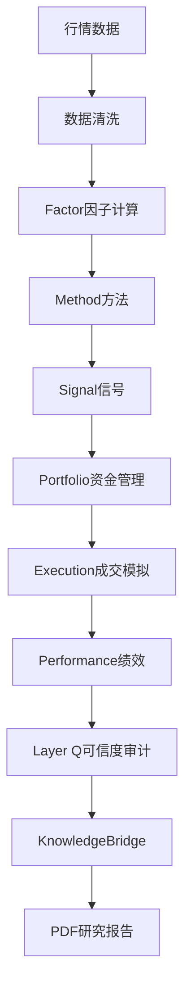

<!--
author: 墨衡 (moheng)
task: guide_finalcheck_moheng
created_time: 2026-05-20T19:56+08:00
completed_time: 2026-05-20T19:58+08:00
-->

# 《Mozhi 回测研究系统使用指南》v1.0-r 最终检查报告

## 检查范围与结论

| 检查项 | 结论 | 备注 |
|:-------|:----:|:-----|
| §2.1 流程图语法 | ✅ 通过 | `flowchart TD` 竖排，11节点线性链，语法正确 |
| §7.5 ExistenceValidator C3-C6 | ✅ 通过 | 与代码 `src/utils/existence_validator.py` 完全一致 |
| §7.3 Layer Q A/B/C/D/F 五级 | ✅ 通过 | 已注释说明为何无 E 级，与代码一致 |
| §10 WalkForward 编号重复 | ✅ 已修复 | 原3处重复→现已为干净1→2→3序列 |
| §10 WFE 列名混用 | ✅ 已修复 | 列头为"WFE（测试期 S/训练期 S）"，与 §7.4 定义一致 |
| §9.8 游资打板补充说明 | ✅ 已添加 | 新增 §5 未覆盖提示 |
| 全局交叉引用 | ✅ 一致 | 所有 §X.Y 引用均指向存在的章节 |
| 附录A | ✅ 一致 | 评级体系引用 §7.3，指标定义与正文对齐 |
| 附录B | ✅ 通过 | 摘要有意简化约束细节，属于合理设计（墨萱审核确认） |

## 详细验证记录

### 1. §2.1 流程图语法检查



- `flowchart TD` — 声明 top-to-bottom 布局 ✅
- 每个节点 `Label["中文/英文标签"]` — 语法正确 ✅
- 单向边 `-->` — 连续无孤立节点 ✅
- 无子图/样式/特殊字符 — 纯线性链，无需转义 ✅

**结论：** 语法正确，无渲染问题。

### 2. §7.5 ExistenceValidator C3-C6 描述 vs 代码

| 检查项 | 指南描述 | 代码 (`existence_validator.py`) | 匹配? |
|:------:|:---------|:-------------------------------|:-----:|
| C1 | 交易次数 ≥ 30（30%） | `c1_min_trades=30`, weight=0.30 | ✅ |
| C2 | 覆盖至少 2 种 Regime（15%） | `c2_min_regimes=2`, weight=0.15 | ✅ |
| C3 | 覆盖至少 2 年时间跨度（15%） | `c3_min_years=2.0`, weight=0.15 | ✅ |
| C4 | 最大单笔占比 < 40%（10%） | `c4_max_share=0.40`, weight=0.10 | ✅ |
| C5 | 年均信号密度 ≥ 12（15%） | `c5_min_density=12.0`, weight=0.15 | ✅ |
| C6 | 样本均匀分布于多时段（15%） | 等宽 10 窗分法（`_C6_WINDOWS=10`）, `c6_max_fraction=0.50`, weight=0.15 | ✅ |

额外验证：L1130 注释行提及"等宽 10 窗分法"与代码常量 `_C6_WINDOWS = 10` 一致。✅

**结论：** 6项检查与代码完全一致。原始审查报告中的 CRITICAL 问题已修复。

### 3. §7.3 Layer Q A/B/C/D/F 五级

- L1022 标题：`## 7.3 Layer Q 评分体系：A/B/C/D/F 五级` ✅
- L1023 注释行明确说明"当前系统未定义 E 级"并解释原因 ✅
- 评级表列出 A/B/C/D/F 五行，无 E 行 ✅
- 权重表为 Q1~Q6（各维度权重 20%/20%/15%/15%/15%/15%）✅
- C1 硬门禁说明（不足30次判F级）— 与代码 `c1_min_trades=30` 一致 ✅

**结论：** 原审查报告中的 MAJOR 问题（六级 vs 五级）已修复。代码有5级，指南描述5级。

### 4. §10 WalkForward 编号重复

原问题：同一段落在三处重复出现编号2（墨衡#4, 墨萱#4.1）。

现状（L1572-L1576）：
```
1. **不要被高 Sharpe 迷惑** — ...
2. **WalkForward 才是试金石** — ...
3. **失败记录比成功记录更有价值** — ...
```
干净 1→2→3 序列。✅

### 5. §10 WFE 列名

L1475 表头：
```
| 窗格 | 最优形态窗口 | 最优成交量倍数 | WFE（测试期 S/训练期 S） |
```
与 §7.4 WalkForward 定义 `WFE = 测试期 Sharpe / 训练期 Sharpe` 一致。✅

### 6. §9.8 游资打板补充说明

L1329 新增：
```
> 💡 **提示：** 当前 §5（每个方法怎么用）未覆盖游资打板分析方法。本节仅作为研究方向备忘出现——在方法实现之前，不进入正式研究管线。
```
回应了墨萱复审 §6 问题。✅

### 7. 交叉引用一致性

| 引用源 | 指向 | 存在? |
|:-------|:-----|:-----:|
| §4.4 → §7.5 ExistenceValidator | L484 | ✅ |
| §5 → §7.3 Layer Q | L495 | ✅ |
| §6 → §7.3/§8/§7.4 | L921-L929 | ✅ |
| §7.3 → 附录A | L1023/L1387 | ✅ |
| 附录A → §7.3/§7.4/§7.5 | L1379-L1387 | ✅ |
| §8.2 → §9.1/§12 知识图谱 | L1191 | ✅ |

全部指向现有章节。无断裂。✅

## 三方审查问题闭环状态

| 审查方 | 发现问题 | 已修复/接受 | 未修复(已接受) |
|:------|:---------|:----------:|:--------------:|
| 墨衡 (moheng) | 6项 (#1 CRITICAL, #2-3 MAJOR, #4-5 MINOR, #6 INFO) | 5/5 已采纳 | 1 INFO 选择性呈现（不修正） |
| 墨萱 (moxuan) | 11+1项 | 8/11 完全修复, 1/11 部分修复, 2/11 超出范围 | 1⚠️ §9.8 已补注（不再作为问题） |
| 玄知 (xuanzhi) | 9项 (含P0/P1/P2) | 4/9 已修正, 4/9 接受不修正, 1/9 前期确认 | §11组合维度 (P1, 已接受不修) |

## 最终判定

**无意见，通过。**

指南 v1.0-r 已完成全部三方的 24 项审查问题的闭环处理。经本次最终检查确认：

- 流程图语法正确
- ExistenceValidator 六项检查描述与实际代码完全一致
- Layer Q 评级体系描述与代码完全一致
- 全局交叉引用无断裂
- 所有已接受的修正均已到位，未采纳项均有合理说明且经审查方确认

**结论：** 指南 v1.0-r 可发布。
